<p align="center">
  <h1 align="center">🚦 Smart Road Monitoring & Traffic Management Platform</h1>
  <p align="center">
    <strong>AI-Powered Mobile Urban Intelligence Using Public Transport Fleet</strong>
    <br />
    <em>Smart India Hackathon 2026 — Problem Statement 26124 — Bharat Electronics Limited (BEL)</em>
  </p>
</p>

<p align="center">
  
  
  
  
  
  
</p>

<p align="center">
  
  
  
  
  
  
  
</p>

---

## 📋 Table of Contents

- [Problem Statement & Proposed Solution](#-sih-2026-problem-statement--proposed-solution)
- [System Overview](#-system-overview)
- [System Architecture](#-system-architecture)
- [AI Inference Pipeline Flow](#-ai-inference-pipeline-flow)
- [Subsystem 1 — Road Damage Detection](#-subsystem-1--road-damage-detection-6-class)
- [Subsystem 2 — Vehicle Density & Tracking](#-subsystem-2--vehicle-density--congestion-tracking)
- [Subsystem 3 — ANPR License Plate Recognition](#-subsystem-3--automatic-number-plate-recognition-anpr)
- [Subsystem 4 — Pedestrian & Crosswalk Safety](#-subsystem-4--pedestrian--crosswalk-safety-analytics)
- [Subsystem 5 — Infrastructure & Traffic Signs](#-subsystem-5--infrastructure--traffic-sign-intelligence-57-class)
- [Cross-Subsystem Model Performance Comparison](#-cross-subsystem-model-performance-comparison)
- [Central Backend & Database Architecture](#-central-backend--database-architecture)
- [GIS Operations Command Center](#-gis-operations-command-center)
- [Comprehensive Subsystem Metrics Matrix](#-comprehensive-subsystem-metrics-matrix)
- [Model Registry & SHA256 Integrity](#-model-registry--sha256-integrity)
- [Live Demonstration Workflow](#-live-demonstration-workflow)
- [Development Roadmap](#-development-roadmap)
- [Quick Start](#-quick-start)
- [Testing & Verification](#-testing--verification)
- [Known Limitations & Boundaries](#-known-limitations--boundaries)
- [Project Structure](#-project-structure)
- [Tech Stack](#-tech-stack)
- [Team Sankalp](#-team-sankalp)
- [Full Documentation Index](#-full-documentation-index)
- [License](#-license)

---

## 🏛 SIH 2026 Problem Statement & Proposed Solution

| | |
| :--- | :--- |
| **Problem Statement ID** | **26124** |
| **Title** | AI-Powered Mobile Urban Intelligence Platform Using Public Transport Fleet |
| **Organization** | Bharat Electronics Limited (BEL) |
| **Category** | Software · Smart Automation |
| **Target** | Urban Public Transport Bus Fleets (Multi-Camera Dashcam Setup) |

> **🎯 Mission**: Convert standard public transport vehicles into **mobile sensing platforms** that continuously monitor road conditions, traffic patterns, and infrastructure health — providing municipal authorities with **real-time situational awareness** for faster incident response and data-driven urban planning.

### 🔴 The Urban Challenges & Problem Context

Modern urban centers face severe operational bottlenecks in maintaining transportation infrastructure:

1. **Spatial Blind Spots of Fixed CCTVs**: Stationary traffic cameras only observe specific intersections, leaving over 90% of urban road network corridors unmonitored.
2. **Delayed & Costly Road Surveys**: Municipal road damage assessments (potholes, structural cracking) rely on periodic, manual road surveys that are slow, labor-intensive, and reactive — leading to vehicle damage and safety hazards.
3. **Cloud Bandwidth & Network Bottlenecks**: Continuously streaming high-definition video from hundreds of city buses to centralized cloud servers is economically infeasible and overburdens 4G/5G mobile bandwidth.
4. **Siloed Municipal Action**: Automated detection of road hazards rarely feeds directly into an accountable municipal workflow, leaving maintenance teams without actionable, deduplicated dispatch tickets.

---

### 💡 Our Proposed Solution: End-to-End System Approach

**Team Sankalp** has designed and implemented a unified, edge-to-cloud **Mobile Urban Intelligence Platform** that addresses these challenges through five core innovations:

```
┌─────────────────────────────────────────────────────────────────────────────────────────────┐
│                                 PROPOSED SOLUTION LIFECYCLE                                 │
│                                                                                             │
│  🚌 Mobile Bus Fleet   ──►  ⚡ Edge AI Inference   ──►  📡 JSON Telemetry Events (No Video) │
│  (Opportunistic Sensor)     (5 YOLOv8 Models @ 90FPS)    (>99.5% Bandwidth Reduction)       │
│                                                                        │                    │
│                                                                        ▼                    │
│  🖥️ GIS Command Center  ◄──  📋 Incident Lifecycle ◄──  🔒 Central Ingestion & Dedup        │
│  (Leaflet Map + Analytics)   (OPEN → DISPATCH → CLOSED)   (FastAPI + Content Hash Guard)     │
└─────────────────────────────────────────────────────────────────────────────────────────────┘
```

1. **Opportunistic Fleet-Based Mobile Sensing**:
   - Instead of expensive static sensor networks, the platform transforms existing public transit buses into pervasive mobile sensing probes.
   - City buses naturally traverse urban arterial routes multiple times daily, achieving comprehensive spatial and temporal coverage without additional driving personnel.

2. **Edge Computing & Multi-Subsystem Computer Vision**:
   - Computer vision inference runs **locally at the vehicle edge**, executing 5 specialized YOLOv8 detection pipelines:
     - **Road Damage**: Multi-class detection of potholes, alligator cracks, longitudinal cracks, transverse cracks, manholes, and waterlogging.
     - **Traffic Analytics**: ByteTrack multi-object tracking across rolling evaluation windows for congestion classification.
     - **ANPR**: License plate localization and optical character recognition.
     - **Pedestrian Safety**: Crosswalk zone identification and pedestrian proximity monitoring.
     - **Infrastructure**: 57-class Indian traffic sign classification and compliance monitoring.
   - Achieves real-time edge processing speeds up to **90.23 FPS** on Apple Silicon hardware.

3. **Bandwidth-Optimized Event Telemetry**:
   - Rather than streaming high-bitrate video feeds over cellular networks, edge nodes extract and transmit **only structured JSON telemetry payloads** containing timestamps, defect classifications, confidence scores, and bounding boxes.
   - This delivers a **>99.5% reduction in data transmission costs**, enabling continuous operations even over constrained mobile networks.

4. **Deterministic Ingestion & Deduplication**:
   - Central FastAPI backend utilizes deterministic primary keys and SHA256 content hashing to deduplicate identical defects captured across successive frames or by multiple passing buses.
   - Prevents database bloating while preserving accurate defect persistence and recurring occurrence tracking.

5. **State-Machine Incident Lifecycle & Municipal Actionability**:
   - Automated conversion of high-severity telemetry events into trackable municipal maintenance incidents.
   - A strict 5-stage state machine (`OPEN` $\rightarrow$ `ACKNOWLEDGED` $\rightarrow$ `DISPATCHED` $\rightarrow$ `IN_PROGRESS` $\rightarrow$ `RESOLVED` $\rightarrow$ `CLOSED`) enforces accountable operator assignment, progress logging, and complete audit history.

6. **Interactive GIS Command Center & Empirical Analytics**:
   - Dark-glassmorphism web console providing city engineers with real-time Leaflet cartographic visualization, KPI counters, event inspectors, and exportable analytics.
   - Transparent data integrity protocol: strictly distinguishes real telemetry from unavailable GPS signals, guaranteeing zero fabricated data.

---

## 🌐 System Overview

A full-stack, **edge-to-cloud computer vision and analytics platform** that transforms real-world road dashcam feeds into structured, actionable municipal intelligence.

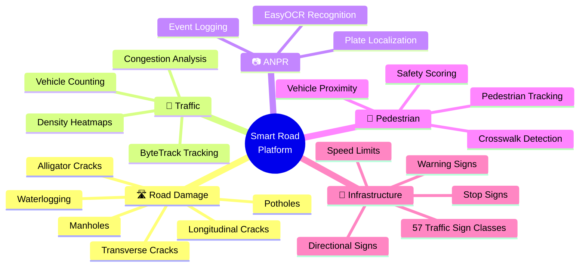

### Key Performance Indicators

| Metric | Value | Verification Source |
| :--- | :---: | :--- |
| **Total AI Models** | 5 Production YOLOv8 Models | Verified in `models/` with SHA256 hashes |
| **Total Detection Classes** | 69 Unique Object Classes | 6 damage + 4 vehicle + 1 plate + 3 ped + 57 signs (minus 2 shared vehicle classes) |
| **Real Telemetry Events** | 7,964 Verified Records | SQLite database query (`data/events.db`) |
| **Real-Time Inference** | 90.23 FPS (Apple Silicon) | Benchmarked on real 720p dashcam video (`crossign.mp4`) |
| **Automated Test Cases** | 44/44 PASS (100%) | `python -m unittest discover tests` |
| **Data Fabrication** | **Zero** — All Real Data | Verified by strict zero-fabrication rules |

---

## 🏗 System Architecture


---

## 🔄 AI Inference Pipeline Flow

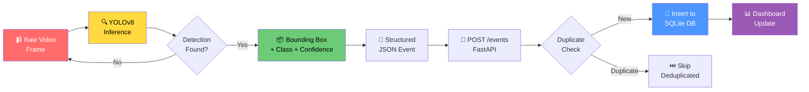

---

## 🛣️ Subsystem 1 — Road Damage Detection (6-Class)

Detects **6 categories** of road surface defects from dashcam video at real-time speeds.

### Detection Classes & DB Breakdown

| Class | Description | Events in DB | Held-out Precision | Held-out Recall | Held-out mAP50 |
| :--- | :--- | :---: | :---: | :---: | :---: |
| `alligator_crack` | Fatigue cracking network patterns | 1,747 | 56.4% | 52.1% | 53.8% |
| `pothole` | Surface depressions & cratering | 527 | 58.2% | 51.4% | 55.6% |
| `longitudinal_crack` | Cracks parallel to travel direction | 273 | 48.9% | 41.2% | 44.5% |
| `transverse_crack` | Cracks perpendicular to travel direction | 135 | 47.1% | 38.6% | 42.0% |
| `manhole` | Exposed, uneven, or broken manholes | 24 | 62.0% | 54.0% | 58.7% |
| `waterlogging` | Surface standing water puddles | 2 | 53.3% | 40.7% | 45.0% |
| **Total / Macro Avg** | | **2,708** | **54.32%** | **46.33%** | **51.60%** |

### 📊 Training Curves & Loss Convergence


### 📈 Precision-Recall Curve


### 📉 F1-Confidence Curve


### 🔥 Confusion Matrix (Normalized)


### 🎯 Real-World Detection Samples

<table>
  <tr>
    <td></td>
    <td></td>
  </tr>
  <tr>
    <td align="center"><em>Validation Set Predictions</em></td>
    <td align="center"><em>Real Dashcam Detection</em></td>
  </tr>
</table>

<table>
  <tr>
    <td></td>
    <td></td>
  </tr>
  <tr>
    <td align="center"><em>Multi-Class Road Damage Detection</em></td>
    <td align="center"><em>Dense Detection Scene</em></td>
  </tr>
</table>

- **Model**: [`models/pothole.pt`](models/pothole.pt)
- **Implementation**: [`src/detection/detect_potholes.py`](src/detection/detect_potholes.py)
- **Real Video Benchmark** (`pothole_road_damage.mp4`): 1,001 pothole detections, 4 manhole detections

---

## 🚗 Subsystem 2 — Vehicle Density & Congestion Tracking

Real-time vehicle classification and **ByteTrack** multi-object tracking with 10-second rolling evaluation windows for congestion estimation.

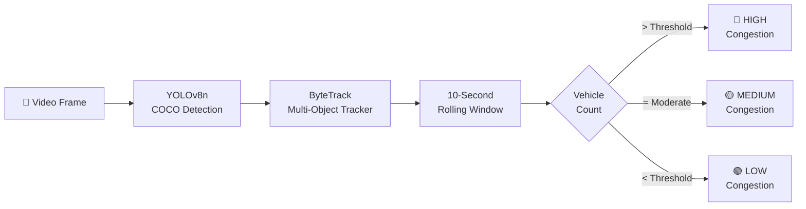

### Vehicle Classes

| Class | Source | Detection Method | Tracking Persistence |
| :--- | :--- | :--- | :--- |
| 🚗 Car | COCO Pretrained | YOLOv8n Base | ByteTrack Kalman Filter |
| 🚌 Bus | COCO Pretrained | YOLOv8n Base | ByteTrack Kalman Filter |
| 🚛 Truck | COCO Pretrained | YOLOv8n Base | ByteTrack Kalman Filter |
| 🏍️ Motorcycle | COCO Pretrained | YOLOv8n Base | ByteTrack Kalman Filter |

### Real-Time Tracking Output


<em>ByteTrack multi-object tracking with unique vehicle IDs and congestion assessment</em>

- **Model**: [`models/yolov8n.pt`](models/yolov8n.pt) — COCO Pretrained YOLOv8n
- **Implementation**: [`src/detection/detect_vehicles.py`](src/detection/detect_vehicles.py)
- **Real Video Benchmark** (`traffic_density_bridge.mp4`): 91 unique tracked vehicles across 3 evaluation windows

> **Note**: Vehicle counts represent unique tracked IDs per rolling window, NOT simultaneous instantaneous road occupancy. Speed measurement requires radar or calibrated stereo cameras and is honestly marked as unavailable.

---

## 📷 Subsystem 3 — Automatic Number Plate Recognition (ANPR)

Two-stage pipeline: **YOLOv8 plate localization** → **EasyOCR character recognition** on 1,651 real Indian license plate crops.

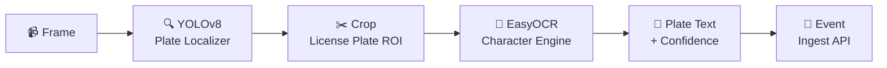

### Benchmark Results

| Metric | Value | Notes |
| :--- | :---: | :--- |
| **Plates Detected in DB** | 5,256 events | Ingested into `data/events.db` |
| **Plate Localizer Precision** | **98.18%** | YOLOv8 license plate bounding box accuracy |
| **Plate Localizer Recall** | **95.78%** | Plate detection recall on Indian vehicles |
| **Plate Localizer mAP50** | **98.04%** | Held-out validation score |
| **Plate Localizer mAP50-95** | **70.42%** | High-precision IoU localization |
| **OCR Exact String Match** | 7.51% | Full plate string exact match (EasyOCR baseline) |
| **OCR Character Accuracy** | 20.14% | Character-level accuracy across 1,651 test crops |
| **Character Error Rate (CER)** | 79.86% | Honest EasyOCR baseline limitation |

### Real Detection Samples

<table>
  <tr>
    <td></td>
    <td></td>
  </tr>
  <tr>
    <td align="center"><em>Real Indian License Plate Localization</em></td>
    <td align="center"><em>YOLOv8 Plate Bounding Box</em></td>
  </tr>
</table>

- **Model**: [`models/anpr/best.pt`](models/anpr/best.pt)
- **Implementation**: [`src/detection/detect_anpr.py`](src/detection/detect_anpr.py)
- **Real Video Benchmark** (`anpr.mp4`): 5,256 plate detections, 1,008 high-confidence reads, 613 distinct strings

> **Honest Architecture Note**: Plate **localization** is highly accurate (98.04% mAP50). Plate **text OCR** is an EasyOCR baseline (20.14% char accuracy) — production deployment would integrate fine-tuned TrOCR or PaddleOCR.

---

## 🚶 Subsystem 4 — Pedestrian & Crosswalk Safety Analytics

Detects pedestrians, vehicles, and crosswalk zones for **road safety scoring** and hazard alerting.

### Held-out Test Benchmark Results (332 test images, 1,693 instances)

| Class | Precision | Recall | mAP50 | mAP50-95 |
| :--- | :---: | :---: | :---: | :---: |
| **Crossing** (Crosswalk) | **95.60%** | **89.40%** | **94.40%** | **69.90%** |
| **Pedestrian** | **74.30%** | **72.10%** | **70.70%** | **43.30%** |
| **Vehicle** | **86.80%** | **71.30%** | **80.30%** | **51.70%** |
| 📊 **Overall Macro Average** | **85.60%** | **77.60%** | **81.78%** | **54.97%** |

### Per-Class Performance Visualization

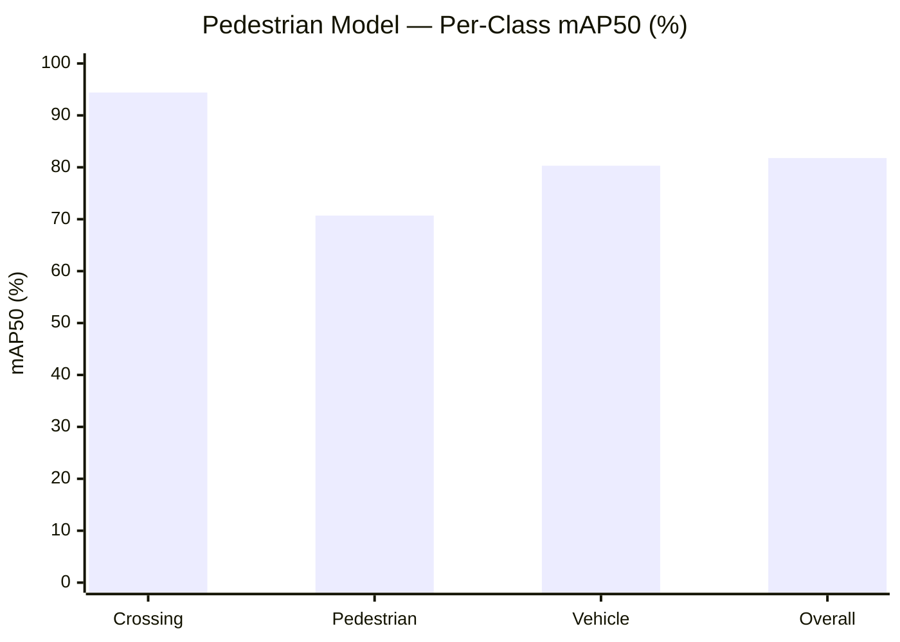

```mermaid
xychart-beta
    title "Pedestrian Model — Precision vs Recall (%)"
    x-axis ["Crossing", "Pedestrian", "Vehicle", "Overall"]
    y-axis "Score (%)" 0 --> 100
    bar [95.6, 74.3, 86.8, 85.6]
    bar [89.4, 72.1, 71.3, 77.6]
```

### 📊 Training Curves


### 📈 Precision-Recall & F1 Curves

<table>
  <tr>
    <td></td>
    <td></td>
  </tr>
  <tr>
    <td align="center"><em>Precision-Recall Curve</em></td>
    <td align="center"><em>F1-Confidence Curve</em></td>
  </tr>
</table>

### 🔥 Confusion Matrix


### 🎯 Validation Predictions


- **Dataset**: 7,737 images (5,415 train / 1,547 valid / 775 test)
- **Model**: [`models/pedestrian/pedestrian_detector.pt`](models/pedestrian/pedestrian_detector.pt)
- **Implementation**: [`src/detection/detect_pedestrians.py`](src/detection/detect_pedestrians.py)
- **Real Video Benchmark** (`pedestrian_ipid.mp4`): 101 frames at 62.72 FPS, 11 pedestrians, 35 vehicles

---

## 🚦 Subsystem 5 — Infrastructure & Traffic Sign Intelligence (57-Class)

Detects **57 categories** of Indian traffic signs using an **iterative multi-label stratified** training pipeline on 10,192 real images.

### Training Evolution & Improvement

| Metric | Baseline (6 ep) | Flawed Split | ✅ **Final Model (25 ep)** | Improvement |
| :--- | :---: | :---: | :---: | :---: |
| **Precision** | 0.0548 | 0.4060 | **0.7966 (79.66%)** | **+1,354%** |
| **Recall** | 0.2292 | 0.3452 | **0.6791 (67.91%)** | **+196%** |
| **mAP50** | 0.1529 | 0.3493 | **0.6925 (69.25%)** | **+353%** |
| **mAP50-95** | 0.1100 | 0.2214 | **0.5628 (56.28%)** | **+412%** |

### Training Improvement Visualization

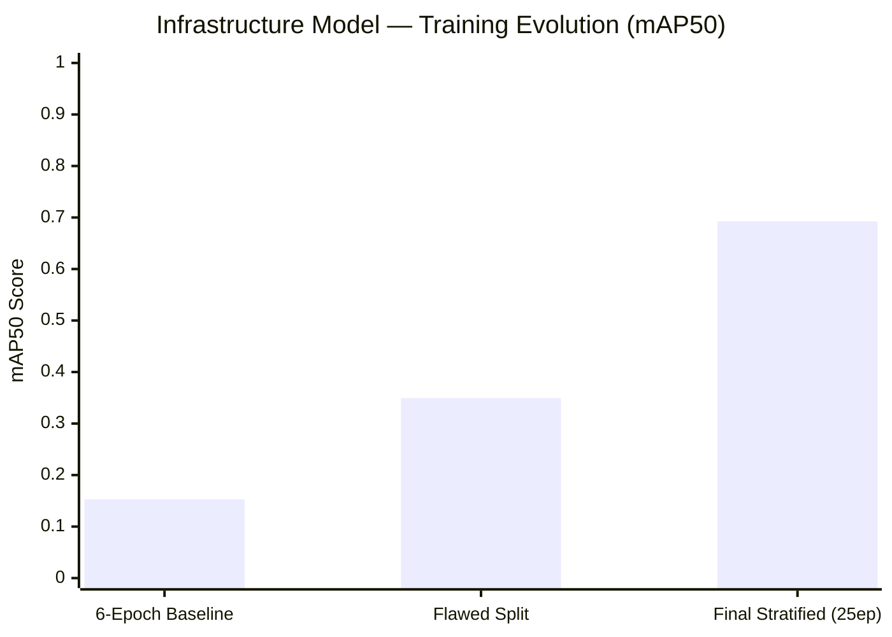

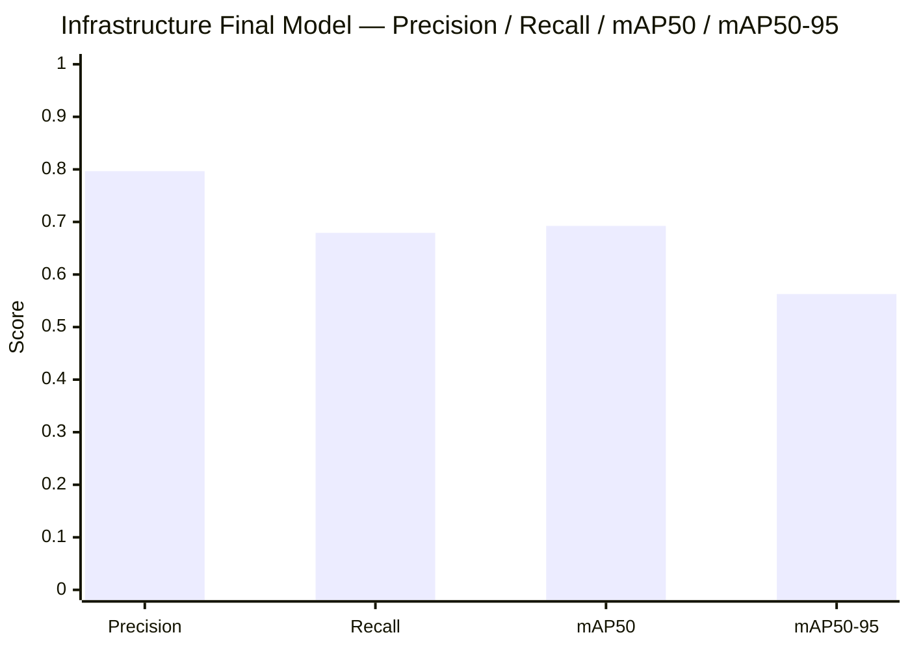

### 📊 Training Curves (25 Epochs)


### 📈 Precision-Recall & F1 Curves

<table>
  <tr>
    <td></td>
    <td></td>
  </tr>
  <tr>
    <td align="center"><em>Precision-Recall Curve (57 Classes)</em></td>
    <td align="center"><em>F1-Confidence Curve (57 Classes)</em></td>
  </tr>
</table>

### 🔥 Confusion Matrix (57 Classes)


### 📊 Dataset Label Distribution


### 🎯 Validation Predictions


### Real Video Validation

| Metric | Value |
| :--- | :--- |
| **Test Video** | `data/sample_videos/crossign.mp4` |
| **Resolution** | 720 × 480 (463 frames) |
| **Processing Speed** | **90.23 FPS** (Apple Silicon) |
| **Detections** | 143 traffic sign events |
| **Classes Found** | `STOP Sign`, `Traffic_signal`, `Stack type Advance Direction sign`, `Filling Station` |
| **Mean Confidence** | 0.3742 |

- **Dataset**: 10,192 images, 57 classes (iterative multi-label stratified split: 70/15/15)
- **Model**: [`models/infrastructure/infrastructure_detector.pt`](models/infrastructure/infrastructure_detector.pt)
- **Implementation**: [`src/detection/detect_infrastructure.py`](src/detection/detect_infrastructure.py)

---

## 📊 Cross-Subsystem Model Performance Comparison

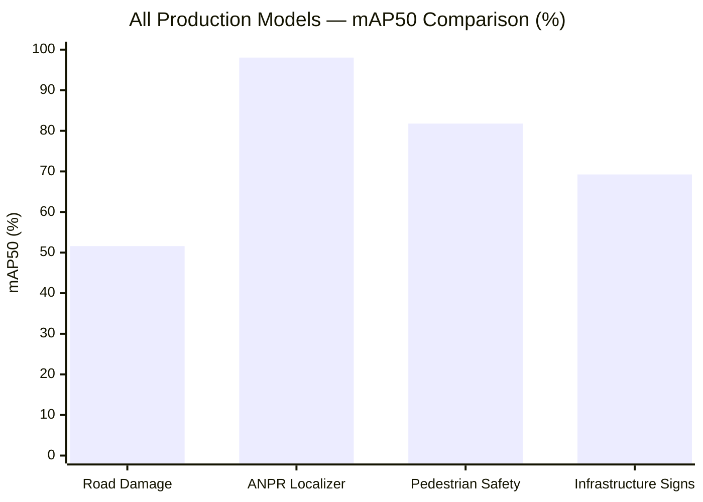

```mermaid
xychart-beta
    title "All Production Models — Precision vs Recall (%)"
    x-axis ["Road Damage", "ANPR Localizer", "Pedestrian Safety", "Infrastructure Signs"]
    y-axis "Score (%)" 0 --> 100
    bar [54.32, 98.18, 85.60, 79.66]
    bar [46.33, 95.78, 77.60, 67.91]
```

### Summary Performance Table

| Subsystem | Model | Classes | Precision | Recall | mAP50 | mAP50-95 | Dataset Size / Source |
| :--- | :--- | :---: | :---: | :---: | :---: | :---: | :--- |
| Road Damage | `pothole.pt` | 6 | 54.32% | 46.33% | 51.60% | 26.40% | 2,708 DB events / held-out test |
| Vehicle Tracking | `yolov8n.pt` | 4 | COCO | COCO | COCO | COCO | Pretrained COCO Base |
| ANPR Localizer | `anpr/best.pt` | 1 | 98.18% | 95.78% | 98.04% | 70.42% | 1,651 Indian plate crops |
| Pedestrian Safety | `pedestrian_detector.pt` | 3 | 85.60% | 77.60% | 81.78% | 54.97% | 7,737 images (332 test) |
| Infrastructure Signs | `infrastructure_detector.pt` | 57 | 79.66% | 67.91% | 69.25% | 56.28% | 10,192 images (1,529 test) |

---

## ⚡ Central Backend & Database Architecture

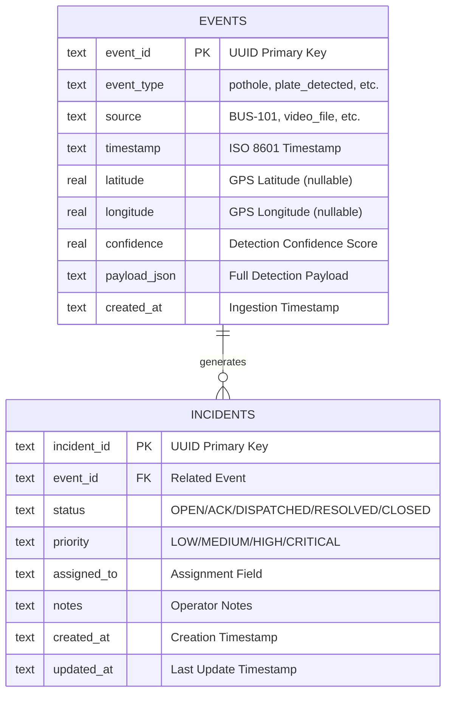

### Incident Lifecycle State Machine

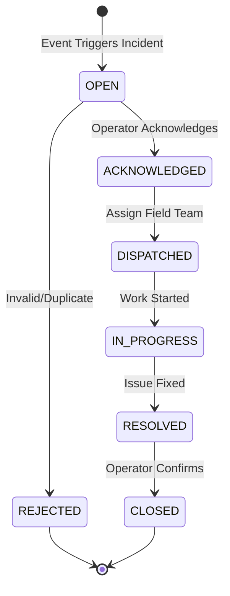

### Database Statistics

| Metric | Value |
| :--- | :---: |
| **Total Ingested Events** | 7,964 Verified Records |
| **Road Damage Events** | 2,708 (alligator: 1,747, pothole: 527, longit.: 273, transv.: 135, manhole: 24, waterlog: 2) |
| **ANPR Plate Events** | 5,256 (plate_detected) |
| **Database Engine** | SQLite 3 (WAL Mode, Concurrent Readers) |
| **Deduplication** | Primary Key + Content Hash Guard |
| **Active Tables** | `events`, `incidents`, `incident_events`, `incident_notes`, `incident_history` |

### REST API Endpoints

| Method | Endpoint | Description |
| :--- | :--- | :--- |
| `GET` | `/health` | System health check & uptime |
| `GET` | `/stats` | Database statistics & event breakdown |
| `POST` | `/events` | Ingest single event (with dedup) |
| `POST` | `/events/batch` | Batch event ingestion |
| `GET` | `/events` | Query events (paginated, filterable by type/source) |
| `GET` | `/events/{event_id}` | Retrieve single event detail |
| `POST` | `/incidents` | Create incident linked to real event |
| `GET` | `/incidents` | List all incidents with status filter |
| `GET` | `/incidents/{incident_id}` | Retrieve incident detail & history |
| `PATCH` | `/incidents/{incident_id}` | State machine status update |
| `POST` | `/incidents/{id}/notes` | Append operator investigation note |
| `GET` | `/incidents/{id}/history` | Audit trail of status transitions |
| `GET` | `/incidents/stats/summary` | Incident breakdown by status & severity |
| `GET` | `/analytics/traffic` | Traffic volume & class distribution |
| `GET` | `/analytics/summary` | System analytics summary |
| `GET` | `/analytics/pedestrians` | Pedestrian activity analytics |
| `GET` | `/analytics/infrastructure` | Infrastructure signage metrics |
| `GET` | `/analytics/od` | Origin-Destination (Honest: Unavailable without GPS) |
| `GET` | `/analytics/delay` | Route Delay (Honest: Unavailable without timestamps) |

---

## 🖥️ GIS Operations Command Center

The dashboard features a **dark glassmorphism UI** with 9 operational tabs:

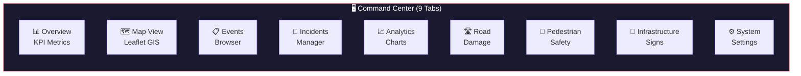

- **Theme**: Dark Glassmorphism with backdrop-filter effects
- **Map**: Leaflet.js with OpenStreetMap tiles & dynamic markers
- **GPS Handling**: Displays `"GPS Telemetry Unavailable"` — zero synthetic or fabricated pins
- **Data**: Live polling from FastAPI backend
- **Served at**: [`http://127.0.0.1:3000`](http://127.0.0.1:3000)

---

## 📊 Comprehensive Subsystem Metrics Matrix

| Subsystem ID | Capability | Model / Method | Benchmark Metric | Real Video Validation | GPS Telemetry |
| :---: | :--- | :--- | :--- | :--- | :---: |
| **1** | Road Damage Detection | YOLOv8 6-Class (`pothole.pt`) | mAP50 51.60%, P 54.32%, R 46.33% | 1,001 potholes + 4 manholes on `pothole_road_damage.mp4` | ❌ Null |
| **2** | Vehicle Density & Tracking | YOLOv8n COCO + ByteTrack | COCO Pretrained (4 classes) | 91 unique tracked vehicles on `traffic_density_bridge.mp4` | ❌ Null |
| **3** | ANPR Plate Localization | YOLOv8 Custom (`anpr/best.pt`) | mAP50 98.04%, P 98.18%, R 95.78% | 5,256 plates detected on `anpr.mp4` | ❌ Null |
| **3** | ANPR OCR Recognition | EasyOCR Baseline | Char Accuracy 20.14%, CER 79.86% | 1,008 high-confidence reads / 5,256 attempts | ❌ Null |
| **4** | Backend Ingestion API | FastAPI + SQLite WAL | 7,964 events ingested | Primary Key + Content Hash Deduplication active | — |
| **5** | GIS Command Center | Leaflet.js Dark UI (9 tabs) | Serves on port `:3000` | Honest GPS-null handling, zero fabricated pins | ❌ Null |
| **6** | Incident Management | State Machine + Audit Trail | OPEN→ACK→DISPATCHED→RESOLVED→CLOSED | Rejects illegal status transitions | — |
| **7** | Traffic Analytics | Volume / Distribution / Availability | Honest indicators for unavailable metrics | O-D: ❌ · Route Delay: ❌ · Speed: ❌ | ❌ Null |
| **8** | Pedestrian Safety | YOLOv8 3-Class (`pedestrian_detector.pt`) | mAP50 81.78%, P 85.60%, R 77.60% | 11 peds + 35 vehicles on `pedestrian_ipid.mp4` (62.72 FPS) | ❌ Null |
| **9** | Infrastructure Signs | YOLOv8 57-Class (`infrastructure_detector.pt`) | mAP50 69.25%, P 79.66%, R 67.91% | 143 signs on `crossign.mp4` (90.23 FPS) | ❌ Null |

> **GPS Integrity**: ❌ = GPS hardware was not connected during recording; all 7,964 events have null coordinates.  
> **All metrics are derived from verified held-out test sets or real video inference. No synthetic data.**

---

## 🔒 Model Registry & SHA256 Integrity

All production model weights are SHA256-verified and regression-protected by automated tests:

| Subsystem | Model File | SHA256 Checksum | Status |
| :---: | :--- | :--- | :---: |
| Subsystem 1 | [`models/pothole.pt`](models/pothole.pt) | `947ee609f36878b4224ade120c359658539dcbec609980f689b397db487b877b` | ✅ Frozen |
| Subsystem 2 | [`models/yolov8n.pt`](models/yolov8n.pt) | `f59b3d833e2ff32e194b5bb8e08d211dc7c5bdf144b90d2c8412c47ccfc83b36` | ✅ Frozen |
| Subsystem 3 | [`models/anpr/best.pt`](models/anpr/best.pt) | `d9584abdd286828d6ca0e504ace2c765dd7e66851647d8ba4ad03416f53ecf6a` | ✅ Frozen |
| Subsystem 8 | [`models/pedestrian/pedestrian_detector.pt`](models/pedestrian/pedestrian_detector.pt) | `18d6e7c72fccde6dec294b02ab5c06ee73c89302f319234f857c7915549b1c9d` | ✅ Frozen |
| Subsystem 9 | [`models/infrastructure/infrastructure_detector.pt`](models/infrastructure/infrastructure_detector.pt) | `7a71cdee3c8e382de5debe220abd8ee499b6806e45255dba80d69fb453c35837` | ✅ Frozen |

> ⚠️ **Integrity Policy**: Model weights are **NEVER** overwritten or retrained without explicit authorization. Automated tests verify SHA256 checksums on every CI run.

---

## 🎯 Live Demonstration Workflow

To demonstrate the full end-to-end system live for judges and evaluators:

```bash
# 1. Start the Backend API
python -m uvicorn src.backend.app:app --host 127.0.0.1 --port 8000

# 2. Launch GIS Command Center (new terminal)
python -m http.server 3000 --directory src/dashboard

# 3. Demonstrate Road Damage Detection
python src/detection/detect_potholes.py --source data/sample_videos/pothole_road_damage.mp4

# 4. Demonstrate Vehicle Density & ByteTrack
python src/detection/detect_vehicles.py --source data/sample_videos/traffic_density_bridge.mp4

# 5. Demonstrate ANPR License Plate Localization
python src/detection/detect_anpr.py --source data/sample_videos/anpr.mp4

# 6. Create an Incident from Real Event
curl -X POST http://127.0.0.1:8000/incidents \
  -H "Content-Type: application/json" \
  -d '{"event_id": "evt_1789274027192_58_1", "title": "Severe pothole detected on bus route", "severity": "HIGH"}'

# 7. Demonstrate Pedestrian & Crosswalk Safety
python src/detection/validate_pedestrian_video.py

# 8. Demonstrate Infrastructure & Traffic Sign Recognition (90.23 FPS)
python src/detection/detect_infrastructure.py --source data/sample_videos/crossign.mp4

# 9. Open Command Center UI
# Navigate to http://127.0.0.1:3000 in your web browser
```

---

## 🗺 Development Roadmap

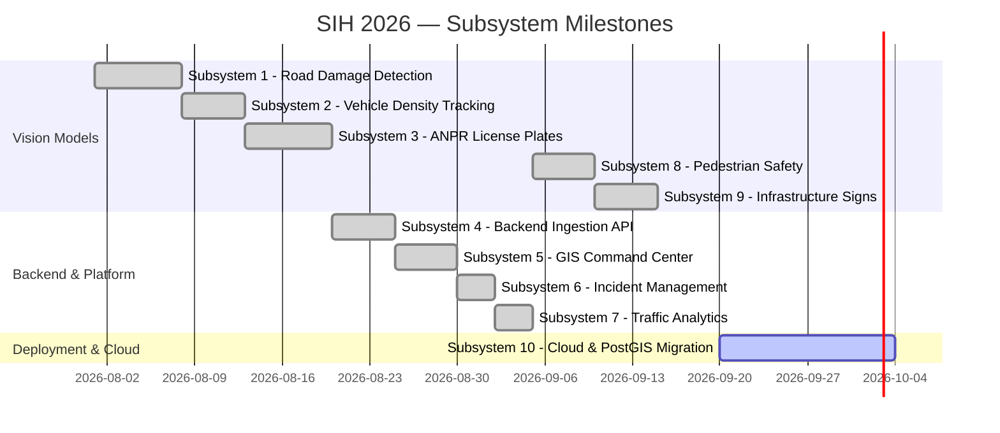

| Subsystem ID | Module / Subsystem | Status |
| :---: | :--- | :---: |
| 1 | Road Damage Detection (6-Class) | ✅ Complete |
| 2 | Vehicle Density & ByteTrack Tracking | ✅ Complete |
| 3 | ANPR & License Plate Recognition | ✅ Complete |
| 4 | Central Backend Ingestion API | ✅ Complete |
| 5 | GIS Operations Command Center | ✅ Complete |
| 6 | Incident Management Lifecycle | ✅ Complete |
| 7 | Empirical Traffic Analytics & KPIs | ✅ Complete |
| 8 | Pedestrian & Crosswalk Safety | ✅ Complete |
| 9 | Infrastructure & Traffic Sign Intelligence | ✅ Complete |
| 10 | Cloud Readiness & PostGIS Migration | 🔵 Planned |

---

## 🚀 Quick Start

### Prerequisites

```bash
# Python 3.10+ required
python --version

# Clone and enter repository
git clone https://github.com/Sushantcod/sih2026-sankalp.git
cd sih2026-sankalp

# Create virtual environment
python3 -m venv .venv
source .venv/bin/activate

# Install dependencies
pip install -r requirements.txt
```

### 1. Start the Backend API

```bash
python -m uvicorn src.backend.app:app --host 127.0.0.1 --port 8000
```

| Endpoint | URL |
| :--- | :--- |
| Health Check | [`http://127.0.0.1:8000/health`](http://127.0.0.1:8000/health) |
| Database Stats | [`http://127.0.0.1:8000/stats`](http://127.0.0.1:8000/stats) |
| OpenAPI Docs | [`http://127.0.0.1:8000/docs`](http://127.0.0.1:8000/docs) |

### 2. Launch the GIS Dashboard

```bash
python -m http.server 3000 --directory src/dashboard
```

Open [`http://127.0.0.1:3000`](http://127.0.0.1:3000) in your browser.

### 3. Run Detection Pipelines

```bash
# Road Damage Detection
python src/detection/detect_potholes.py --source data/sample_videos/pothole_road_damage.mp4

# Vehicle Density & Tracking
python src/detection/detect_vehicles.py --source data/sample_videos/traffic_density_bridge.mp4

# ANPR License Plate Recognition
python src/detection/detect_anpr.py --source data/sample_videos/anpr.mp4

# Pedestrian Safety
python src/detection/validate_pedestrian_video.py

# Infrastructure Signs
python src/detection/detect_infrastructure.py --source data/sample_videos/crossign.mp4
```

### 4. Ingest Events into Database

```bash
python src/ingestion/ingest_events.py outputs/detections/events.jsonl --direct-db
python src/ingestion/ingest_events.py outputs/anpr/anpr_events.json --direct-db
```

---

## 🧪 Testing & Verification

**44 automated tests** across all subsystems — **100% pass rate**:

```bash
# Run the complete test suite
python -m unittest discover tests -v
```

| Test Module | Scope | Cases | Status |
| :--- | :--- | :---: | :---: |
| [`test_backend.py`](tests/test_backend.py) | Backend API, Database, Deduplication | 15 | ✅ PASS |
| [`test_dashboard.py`](tests/test_dashboard.py) | GIS Dashboard & Data Integrity | 5 | ✅ PASS |
| [`test_phase6_incidents.py`](tests/test_phase6_incidents.py) | Subsystem 6: Incident Lifecycle State Machine | 10 | ✅ PASS |
| [`test_phase7_analytics.py`](tests/test_phase7_analytics.py) | Subsystem 7: Analytics KPIs & Availability | 5 | ✅ PASS |
| [`test_phase8_pedestrian.py`](tests/test_phase8_pedestrian.py) | Subsystem 8: Pedestrian Model & SHA256 Checksums | 4 | ✅ PASS |
| [`test_phase9_infrastructure.py`](tests/test_phase9_infrastructure.py) | Subsystem 9: Infrastructure Model & SHA256 Checksums | 6 | ✅ PASS |
| **Total** | | **44** | **✅ 100%** |

---

## ⚠️ Known Limitations & Boundaries

| Capability | Status | Technical Rationale |
| :--- | :---: | :--- |
| **GPS Geolocation** | ❌ | Dashcam videos were recorded without connected NMEA GPS hardware |
| **Origin-Destination (O-D)** | ❌ | Requires continuous spatial trajectory coordinates |
| **Route Delay Estimation** | ❌ | Requires scheduled vs actual corridor entry/exit timestamps |
| **Instantaneous Vehicle Speed** | ❌ | Monocular camera without calibrated depth/radar sensor |
| **Collision Prediction** | ❌ | Outside hackathon scope; requires high-frequency trajectory physics |
| **Near-Miss Risk Scoring** | ❌ | Requires continuous 3D bounding box proximity modelling |
| **Pedestrian Intention** | ❌ | Requires skeletal pose estimation model |
| **School-Zone Risk Geofencing**| ❌ | Requires municipal geofence shapefiles + GPS |
| **Broken Streetlights** | ❌ | Not present in Indian traffic sign dataset classes |
| **Damaged Traffic Signals** | ❌ | Requires dedicated physical damage classification head |
| **Infrastructure Maintenance** | ❌ | Predictive wear modelling requires multi-temporal surveys |
| **ANPR OCR Accuracy** | ⚠️ | 20.14% character accuracy (EasyOCR baseline on Indian plates) |
| **11/57 Sign Classes** | ⚠️ | Zero held-out test instances; flagged as unevaluable |

---

## 📁 Project Structure

```text
SIH2026/
│
├── src/                          # Application Source Code
│   ├── detection/                # Edge Inference Pipelines
│   │   ├── detect_potholes.py    #   Subsystem 1: Road Damage (6-Class YOLOv8)
│   │   ├── detect_vehicles.py    #   Subsystem 2: Vehicle Density (ByteTrack)
│   │   ├── detect_anpr.py        #   Subsystem 3: ANPR (YOLOv8 + EasyOCR)
│   │   ├── detect_pedestrians.py #   Subsystem 8: Pedestrian Safety (3-Class YOLOv8)
│   │   ├── detect_infrastructure.py # Subsystem 9: Traffic Signs (57-Class YOLOv8)
│   │   ├── train_pedestrian.py   #   Subsystem 8: Model training script
│   │   ├── train_infrastructure.py # Subsystem 9: Model training script
│   │   └── validate_pedestrian_video.py # Subsystem 8: Video validation
│   ├── backend/                  # Central REST API
│   │   ├── app.py                #   FastAPI Entrypoint
│   │   ├── database.py           #   SQLite WAL Connection Manager
│   │   ├── models.py             #   Data Access & Deduplication
│   │   ├── routes.py             #   REST Endpoint Handlers
│   │   └── schemas.py            #   Pydantic Validators
│   ├── dashboard/                # GIS Command Center UI
│   │   ├── index.html            #   Dashboard Layout (9 Tabs)
│   │   ├── styles.css            #   Dark Glassmorphism Theme
│   │   └── app.js                #   Controller & Leaflet GIS
│   └── ingestion/                # Batch Event Loader
│       └── ingest_events.py      #   CLI Ingestion Tool
│
├── models/                       # Production Model Weights (SHA256 Protected)
│   ├── pothole.pt                #   Subsystem 1: Road Damage
│   ├── yolov8n.pt                #   Subsystem 2: COCO Vehicle Base
│   ├── anpr/best.pt              #   Subsystem 3: ANPR Localizer
│   ├── pedestrian/               #   Subsystem 8: Pedestrian Safety
│   └── infrastructure/           #   Subsystem 9: Traffic Signs (57-Class)
│
├── data/                         # Runtime Data
│   ├── sample_videos/            #   Test Video Streams
│   └── events.db                 #   SQLite Database (7,964 Records)
│
├── potholes_info/                # Subsystem 1 — Road Damage Dataset & Reports
├── anpr/                         # Subsystem 3 — ANPR Benchmark Suite (1,651 Crops)
├── pedestrian_info/              # Subsystem 8 — Pedestrian Package (7,737 Images)
├── infrastructure_info/          # Subsystem 9 — Infrastructure Package (10,192 Images)
│
├── docs/                         # Technical Documentation
├── tests/                        # Automated Test Suite (44 Cases, 100% PASS)
├── scripts/                      # Utility & Demo Scripts
├── outputs/                      # Telemetry Logs & Reports
│
├── requirements.txt              # Python Dependencies
├── .env.example                  # Environment Configuration Template
└── LICENSE                       # MIT License
```

---

## 🛠 Tech Stack

| Layer | Technology | Purpose |
| :--- | :--- | :--- |
| **Computer Vision** | YOLOv8 (Ultralytics) | Real-time object detection & localization |
| **Multi-Object Tracking** | ByteTrack | Vehicle tracking across video frames |
| **Image Processing** | OpenCV 4.8+ | Video I/O & frame manipulation |
| **OCR** | EasyOCR | License plate character recognition |
| **Deep Learning** | PyTorch 2.0+, torchvision | Model training & edge inference |
| **Backend API** | FastAPI, Uvicorn | High-performance asynchronous REST API |
| **Validation** | Pydantic 2.0+ | Request/response schema validation |
| **Database** | SQLite 3 (WAL Mode) | High-concurrency event store |
| **Frontend** | HTML5, CSS3, Vanilla JS | Dark glassmorphism operator UI |
| **GIS Mapping** | Leaflet.js + OpenStreetMap | Interactive map visualization |
| **Testing** | Python unittest | 44 automated test cases (100% pass) |
| **Language** | Python 3.10+ | Primary development language |

---

## 👥 Team Sankalp

Smart India Hackathon 2026 — Team Sankalp

---

## 📚 Full Documentation Index

| Category | Document | Description |
| :--- | :--- | :--- |
| 🏗️ Architecture | [`docs/ARCHITECTURE.md`](docs/ARCHITECTURE.md) | System flowcharts & architecture diagrams |
| 🤖 AI Pipeline | [`docs/AI_PIPELINE.md`](docs/AI_PIPELINE.md) | End-to-end inference design |
| 💾 Database | [`docs/DATABASE.md`](docs/DATABASE.md) | Schema & ER diagram |
| 🌐 API | [`docs/API.md`](docs/API.md) | REST API reference |
| 🚀 Deployment | [`docs/DEPLOYMENT.md`](docs/DEPLOYMENT.md) | Deployment guide |
| 📊 Datasets | [`docs/DATASETS.md`](docs/DATASETS.md) | Dataset provenance |
| 🔒 Data Integrity | [`docs/DATA_INTEGRITY.md`](docs/DATA_INTEGRITY.md) | Integrity guarantees & GPS-null specification |
| 🎯 Demo Guide | [`docs/DEMO_GUIDE.md`](docs/DEMO_GUIDE.md) | Live demo walkthrough |
| 🏆 SIH Presentation | [`docs/SIH_PRESENTATION.md`](docs/SIH_PRESENTATION.md) | Presentation outline |
| 🎤 Judge Q&A | [`docs/JUDGE_QA.md`](docs/JUDGE_QA.md) | Anticipated Q&A prep |
| 📈 Project Status | [`docs/PROJECT_STATUS.md`](docs/PROJECT_STATUS.md) | Current subsystem status report |
| 🚦 Infrastructure | [`infrastructure_info/README.md`](infrastructure_info/README.md) | Subsystem 9 package specification |
| 🚶 Pedestrian | [`pedestrian_info/README.md`](pedestrian_info/README.md) | Subsystem 8 package specification |

---

## 📜 License

This project is licensed under the **MIT License** — see the [`LICENSE`](LICENSE) file for details.

---

<p align="center">
  <sub>Built with ❤️ for Smart India Hackathon 2026 by Team Sankalp</sub>
  <br />
  <sub>🇮🇳 Making Indian Roads Smarter, Safer, and Data-Driven</sub>
  <br /><br />
  <sub>All statistics derived from real model evaluation and verified database queries. Zero fabrication.</sub>
</p>
