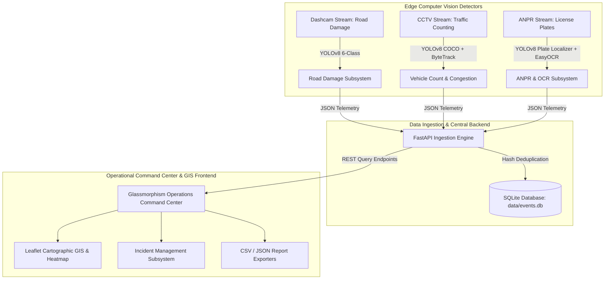

# SIH 2026 — Smart Road Monitoring & Traffic Management Platform

[](file:///Users/sushant/Documents/SIH2026/scripts/verify_project.sh)
[](file:///Users/sushant/Documents/SIH2026/requirements.txt)
[](file:///Users/sushant/Documents/SIH2026/src/backend/app.py)
[](file:///Users/sushant/Documents/SIH2026/data/events.db)
[](file:///Users/sushant/Documents/SIH2026/LICENSE)

An enterprise-grade, edge-to-cloud AI platform built for **Smart India Hackathon 2026**. The platform performs multi-class road damage detection, vehicle density and ByteTrack multi-object tracking, Automatic Number Plate Recognition (ANPR), high-throughput FastAPI telemetry ingestion, deterministic event deduplication, real-time incident dispatch management, and a dark-theme Glassmorphism Operations Command Center.

---

## 📸 Executive Summary & System Architecture



---

## 🚀 Development Capability & Status Matrix

| Stage | Capability | Implementation Files | Status | Verified Deliverable / Metric |
| :--- | :--- | :--- | :--- | :--- |
| **Stage 1** | Road Damage Detection | [`src/detection/detect_potholes.py`](file:///Users/sushant/Documents/SIH2026/src/detection/detect_potholes.py) | **COMPLETE** | 6-Class YOLOv8 model (`models/pothole.pt`), 2,708 telemetry records. |
| **Stage 2** | Vehicle Density & Tracking | [`src/detection/detect_vehicles.py`](file:///Users/sushant/Documents/SIH2026/src/detection/detect_vehicles.py) | **COMPLETE** | COCO YOLOv8n + ByteTrack 10s window tracking, thresholding. |
| **Stage 3** | ANPR & EasyOCR Subsystem | [`src/detection/detect_anpr.py`](file:///Users/sushant/Documents/SIH2026/src/detection/detect_anpr.py) | **COMPLETE WITH OCR LIMITATION** | YOLOv8 Plate Localizer (`models/anpr/best.pt`), 5,256 events, EasyOCR evaluation. |
| **Stage 4** | Backend Ingestion API | [`src/backend/`](file:///Users/sushant/Documents/SIH2026/src/backend/), [`src/ingestion/ingest_events.py`](file:///Users/sushant/Documents/SIH2026/src/ingestion/ingest_events.py) | **COMPLETE** | FastAPI service on `http://127.0.0.1:8000`, 7,964 events in `data/events.db`. |
| **Stage 5** | GIS Operations Dashboard | [`src/dashboard/`](file:///Users/sushant/Documents/SIH2026/src/dashboard/) | **COMPLETE WITH GPS LIMITATION** | Served on `http://127.0.0.1:3000`, Leaflet dark map, honest GPS-null Mode B. |
| **Stage 6** | Incident Management Subsystem | [`src/backend/models.py`](file:///Users/sushant/Documents/SIH2026/src/backend/models.py), [`src/backend/routes.py`](file:///Users/sushant/Documents/SIH2026/src/backend/routes.py) | **COMPLETE** | Incident CRUD, state machine validation, audit history, UI tab. |
| **Stage 7** | Analytics & Automated Exporters | [`src/dashboard/app.js`](file:///Users/sushant/Documents/SIH2026/src/dashboard/app.js) | **COMPLETE** | CSV & JSON report export buttons, DB statistics summary. |
| **Stage 8** | Pedestrian Safety Analytics | N/A | **PLANNED** | Requires future authorization. |
| **Stage 9** | Infrastructure Checks | N/A | **PLANNED** | Requires future authorization. |
| **Stage 10** | Cloud Scaling & PostGIS Migration | N/A | **PLANNED** | Requires future authorization. |

---

## 🎯 Key Features

1. **Multi-Class Road Damage Detection**: Fine-tuned 6-class YOLOv8 model recognizing Potholes, Alligator Cracks, Longitudinal Cracks, Transverse Cracks, Manholes, and Waterlogging.
2. **ByteTrack Vehicle Counting & Congestion**: Object tracking over 10-second rolling evaluation windows to count unique vehicle IDs across cars, buses, trucks, and motorcycles.
3. **ANPR License Plate Localization**: High-precision YOLOv8 plate detector paired with EasyOCR text extraction.
4. **FastAPI Deduplicating Ingestion Engine**: High-throughput REST API featuring primary key and deterministic SHA256 content hash deduplication.
5. **State-Machine Driven Incident Management**: Complete incident lifecycle (`OPEN` -> `ACKNOWLEDGED` -> `IN_PROGRESS` -> `RESOLVED` -> `CLOSED`) with status transition validation, operator assignment, and audit history logging.
6. **Glassmorphism Operations Command Center**: 9-tab interactive dashboard with real-time KPI metrics, query filters, raw JSON payload inspector, system health diagnostics, and single-click CSV/JSON report exports.
7. **Strict Zero-Fabrication Policy**: Enforces 100% honest representation of offline video telemetry (`latitude: null, longitude: null`, Mode B) without generating synthetic GPS coordinates.

---

## 🔒 Protected Baseline Model Checksums & DB Integrity

| Asset Path | Asset Description | Baseline SHA256 / Audit Baseline | Baseline Status |
| :--- | :--- | :--- | :--- |
| `models/pothole.pt` | Road Damage YOLOv8 Model | `947ee609f36878b4224ade120c359658539dcbec609980f689b397db487b877b` | **VERIFIED PASS** |
| `models/anpr/best.pt` | ANPR YOLOv8 Plate Localizer | `d9584abdd286828d6ca0e504ace2c765dd7e66851647d8ba4ad03416f53ecf6a` | **VERIFIED PASS** |
| `models/yolov8n.pt` | COCO Pretrained Base Model | `f59b3d833e2ff32e194b5bb8e08d211dc7c5bdf144b90d2c8412c47ccfc83b36` | **VERIFIED PASS** |
| `data/events.db` | SQLite Database Store | **7,964 Total Records** (0 mapped, 7,964 unmapped) | **VERIFIED PASS** |

---

## 📊 Verified Benchmark Metrics

### Road Damage Subsystem (`models/pothole.pt`)
- **mAP50**: 51.60% across 6 defect classes on held-out test data.
- **Precision**: 54.32% | **Recall**: 46.33% | **mAP50-95**: 26.40%.
- **Real Video Ingestion (`BUS-101`)**: 2,708 telemetry records stored in `data/events.db`.

### ANPR Subsystem (`models/anpr/best.pt`)
- **Plate Localizer mAP50**: 98.04% on 1,651 Indian plate crops benchmark.
- **Plate Localizer Precision**: 98.18% | **Recall**: 95.78%.
- **Real Video Ingestion (`anpr.mp4`)**: 5,256 plate detection records stored in `data/events.db`.
- **OCR Character Accuracy**: 20.14% (recognized limitation; strings treated as candidate reads).

---

## 🛠️ Technology Stack

- **Core AI / Computer Vision**: Python 3.10+, PyTorch, Ultralytics YOLOv8, OpenCV, ByteTrack, EasyOCR.
- **Backend API**: FastAPI, Uvicorn, Pydantic v2, SQLite 3 (WAL mode).
- **Frontend Command Center**: Vanilla HTML5, Modern CSS Glassmorphism, JavaScript (ES6+), Leaflet GIS Cartography.
- **Testing & Tooling**: Pytest, Requests, Shell Automation Scripts.

---

## 💻 Quick Start & Demonstration

### 1. Run Complete Automated System Verification
```bash
./scripts/verify_project.sh
```

### 2. Launch Operations Command Center Demo
```bash
./scripts/run_demo.sh
```
Access active local endpoints:
- **GIS Operations Dashboard UI**: `http://127.0.0.1:3000`
- **FastAPI Central Backend API**: `http://127.0.0.1:8000`
- **Interactive OpenAPI Swagger Docs**: `http://127.0.0.1:8000/docs`
- **Database Health Endpoint**: `http://127.0.0.1:8000/health`
- **Empirical Statistics**: `http://127.0.0.1:8000/stats`

---

## 🧪 Automated Testing

The codebase includes full automated test coverage for backend API contracts, database deduplication, incident lifecycle transitions, and dashboard data integrity:
```bash
# Run backend & incident management test suite (15/15 PASS)
python tests/test_backend.py

# Run dashboard & data integrity test suite (5/5 PASS)
python tests/test_dashboard.py
```

---

## 📚 Complete Project Documentation Index

- [`docs/PROJECT_AUDIT.md`](file:///Users/sushant/Documents/SIH2026/docs/PROJECT_AUDIT.md) — Comprehensive System Audit Report.
- [`docs/ARCHITECTURE.md`](file:///Users/sushant/Documents/SIH2026/docs/ARCHITECTURE.md) — System Flowcharts & 9 Mermaid Architecture Diagrams.
- [`docs/AI_PIPELINE.md`](file:///Users/sushant/Documents/SIH2026/docs/AI_PIPELINE.md) — AI Model Specifications, Hyperparameters & Metrics.
- [`docs/API.md`](file:///Users/sushant/Documents/SIH2026/docs/API.md) — Central Backend REST API Endpoint Specification.
- [`docs/DATABASE.md`](file:///Users/sushant/Documents/SIH2026/docs/DATABASE.md) — Relational Database Schema, ER Diagram & Index Specs.
- [`docs/DATASETS.md`](file:///Users/sushant/Documents/SIH2026/docs/DATASETS.md) — Dataset Provenance & Label Specs.
- [`docs/DATA_INTEGRITY.md`](file:///Users/sushant/Documents/SIH2026/docs/DATA_INTEGRITY.md) — Zero Fabrication Policy & Baseline Checksums.
- [`docs/DEMO_GUIDE.md`](file:///Users/sushant/Documents/SIH2026/docs/DEMO_GUIDE.md) — 5-to-10 Minute Judge Demonstration Script.
- [`docs/SIH_PRESENTATION.md`](file:///Users/sushant/Documents/SIH2026/docs/SIH_PRESENTATION.md) — 20-Slide Hackathon Presentation Structure.
- [`docs/JUDGE_QA.md`](file:///Users/sushant/Documents/SIH2026/docs/JUDGE_QA.md) — 20 Judge Q&A Defense Questions & Technical Answers.
- [`docs/DEPLOYMENT.md`](file:///Users/sushant/Documents/SIH2026/docs/DEPLOYMENT.md) — Local, Docker & Future Cloud Deployment Guide.
- [`docs/PROJECT_STATUS.md`](file:///Users/sushant/Documents/SIH2026/docs/PROJECT_STATUS.md) — Capability Development Matrix.

---

## 📄 License

This project is licensed under the MIT License — see the [`LICENSE`](file:///Users/sushant/Documents/SIH2026/LICENSE) file for details.
