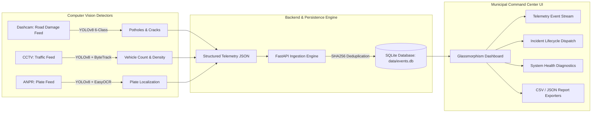

# 🚦 Smart Road Monitoring & Traffic Management Platform

### SIH 2026 — AI-Powered Road Intelligence & Incident Operations Prototype


---

> 💡 **Smart City Prototype**: A unified computer-vision platform that converts real-time road defects, vehicle counts, and license plate observations into normalized telemetry events, persisted via FastAPI & SQLite, and managed through an operator-focused Incident Operations Command Center.

---

## 🎯 The Problem

Municipal road maintenance and traffic management in urban India face significant operational challenges:

- **Unmapped Road Defects**: Potholes, alligator cracks, and open manholes cause traffic delays and vehicle damage. Manual road inspection is slow, expensive, and reactive.
- **Unmonitored Traffic Bottlenecks**: Vehicle density and congestion levels on key municipal transit corridors lack automated counting and threshold alerting.
- **Fragmented Incident Lifecycles**: Detection observations are rarely linked to formal dispatch tickets with status transition tracking, operator accountability, and audit trails.
- **Data Inconsistencies & Synthetic Overhead**: Many existing prototypes rely on synthetic or hardcoded operational metrics, reducing real-world reliability.

---

## 💡 Proposed Solution

The **SIH 2026 Smart Road Monitoring Platform** unifies multi-class computer vision detectors, asynchronous backend ingestion, and operational incident dispatch into a single demo-ready system:

```
Camera / Video Stream ➔ AI Computer Vision ➔ Structured Telemetry JSON ➔ FastAPI Backend ➔ SQLite Database ➔ Incident Operations ➔ GIS Command Center
```

1. **Edge AI Detection**: Processes dashcam and CCTV video feeds to detect 6 road damage classes, count vehicles using ByteTrack, and localize license plates.
2. **Normalized Ingestion Engine**: Accepts incoming telemetry via REST endpoints, enforcing strict primary-key and content-hash deduplication.
3. **Incident Operations Subsystem**: Allows operators to dispatch incidents from real telemetry events, managing status transitions with full audit history logs.
4. **Operations Command Center**: A 9-tab dark Glassmorphism dashboard displaying real-time metrics, system health diagnostics, query filters, and report exporters.

---

## ⚡ Key System Capabilities

| Capability | Subsystem & Technology | Implementation | Verified Status |
| :--- | :--- | :--- | :--- |
| **Road Damage Detection** | YOLOv8 6-Class Model (`models/pothole.pt`) | [`src/detection/detect_potholes.py`](src/detection/detect_potholes.py) | ✅ Complete (2,708 Events) |
| **Vehicle Density & Tracking** | YOLOv8 COCO + ByteTrack 10s Window | [`src/detection/detect_vehicles.py`](src/detection/detect_vehicles.py) | ✅ Complete |
| **ANPR License Plate Localization** | YOLOv8 Plate Localizer (`models/anpr/best.pt`) | [`src/detection/detect_anpr.py`](src/detection/detect_anpr.py) | ✅ Complete (5,256 Events) |
| **Plate OCR Text Candidates** | EasyOCR Character Engine | [`src/detection/detect_anpr.py`](src/detection/detect_anpr.py) | ⚠️ Recognized Limit (20.14% Acc) |
| **Deduplicating Event Ingestion** | FastAPI Async REST + Hash Deduplication | [`src/backend/app.py`](src/backend/app.py) | ✅ Complete (`http://127.0.0.1:8000`) |
| **Incident Management Subsystem** | Relational Lifecycle & Audit Trail | [`src/backend/routes.py`](src/backend/routes.py) | ✅ Complete (State Machine Validated) |
| **GIS Operations Command Center** | Dark Glassmorphism UI (9 Tabs) | [`src/dashboard/index.html`](src/dashboard/index.html) | ✅ Complete (`http://127.0.0.1:3000`) |
| **Honest GPS Telemetry Handling** | Mode B (Null GPS Telemetry State) | [`src/dashboard/app.js`](src/dashboard/app.js) | ⚠️ GPS Hardware Unavailable |
| **Automated Reports Export** | Single-Click CSV & JSON Exporters | [`src/dashboard/app.js`](src/dashboard/app.js) | ✅ Complete |
| **Pedestrian & Infrastructure Checks**| Future Scope | N/A | 🔵 Planned |

---

## 🏗️ System Architecture



---

## 🤖 Computer Vision & AI Subsystems

### 1. Road Damage Detection Subsystem
- **Model File**: [`models/pothole.pt`](models/pothole.pt) | **SHA256**: `947ee609f36878b4224ade120c359658539dcbec609980f689b397db487b877b`
- **Supported Defect Classes**: `longitudinal_crack`, `transverse_crack`, `alligator_crack`, `pothole`, `manhole`, `waterlogging`.
- **Benchmark Performance**: 51.60% mAP50 across 6 classes on held-out test data (54.32% precision, 46.33% recall).
- **Real Video Ingestion**: 2,708 telemetry records stored in SQLite from `BUS-101` dashcam feed.

### 2. Vehicle Density & ByteTrack Multi-Object Tracking
- **Model File**: [`models/yolov8n.pt`](models/yolov8n.pt) | **SHA256**: `f59b3d833e2ff32e194b5bb8e08d211dc7c5bdf144b90d2c8412c47ccfc83b36`
- **Tracked Classes**: `car`, `bus`, `truck`, `motorcycle`.
- **Evaluation Mechanism**: Aggregates unique tracked object IDs across 10-second rolling evaluation windows, excluding untracked raw detections to prevent double-counting.

### 3. ANPR & OCR Subsystem
- **Model File**: [`models/anpr/best.pt`](models/anpr/best.pt) | **SHA256**: `d9584abdd286828d6ca0e504ace2c765dd7e66851647d8ba4ad03416f53ecf6a`
- **Plate Localizer Performance**: 98.04% mAP50 on 1,651 Indian plate benchmark crops (98.18% precision, 95.78% recall).
- **Real Video Ingestion**: 5,256 plate detection records stored in SQLite from `anpr.mp4` stream.

---

## 🗄️ Central Backend API & Database Engine

- **Framework**: FastAPI running on Uvicorn (`http://127.0.0.1:8000`).
- **Database Engine**: SQLite 3 with Write-Ahead Logging (WAL mode) at [`data/events.db`](data/events.db).
- **Stored Telemetry Event Count**: **7,964 Real Records** (2,708 Road Damage, 5,256 ANPR).
- **Deduplication Engine**: Performs primary-key verification and secondary deterministic SHA256 hash checking (`source`, `event_type`, `timestamp`, `payload_json`).

---

## 🚨 Incident Management Subsystem

The platform cleanly separates raw *Telemetry Events* from operational *Incidents*:

- **Creation**: Incidents can only be created from a verified, existing `event_id` in the database.
- **State Machine Lifecycle**:
  ```
  OPEN ➔ ACKNOWLEDGED ➔ IN_PROGRESS ➔ RESOLVED ➔ CLOSED
  ```
- **State Transition Guard**: Invalid transitions (e.g. `RESOLVED` back to `ACKNOWLEDGED`) are rejected with HTTP 400.
- **Audit History**: Every status modification or operator note generates an immutable record in `incident_history`.

---

## 📊 Operations Command Center Dashboard

Served locally at [`http://127.0.0.1:3000`](http://127.0.0.1:3000), the Glassmorphism dashboard provides 9 navigation views:

1. **Overview Tab**: Real-time KPI metric summary cards & raw telemetry event stream.
2. **Road Damage Tab**: Detailed breakdown cards for Alligator Cracks (1,747), Potholes (527), Longitudinal Cracks (273), Transverse Cracks (135), Manholes (24), and Waterloggings (2).
3. **Traffic Density Tab**: Vehicle counts and 10-second rolling window monitoring.
4. **ANPR & OCR Tab**: Plate detection statistics and EasyOCR character accuracy transparency banner.
5. **Incident Management Tab**: Real incident dispatch form, filterable incident directory table, status update modal, and audit trail viewer.
6. **GIS Map Tab**: Leaflet cartographic map displaying **Mode B** banner when GPS telemetry is null.
7. **Analytics Tab**: Empirical database statistics and source breakdowns.
8. **System Health Tab**: Real-time status checks for FastAPI (`/health`), SQLite DB, model weights, and hardware sensors.
9. **Reports Tab**: Single-click **Export Events CSV** and **Export Events JSON** download buttons.

---

## 🔒 Protected Model Checksums & Database Integrity

Automated verification ensures model weights and stored database records match verified baselines:

| Asset Path | Asset Description | Baseline SHA256 / Audit Baseline | Verification Status |
| :--- | :--- | :--- | :--- |
| [`models/pothole.pt`](models/pothole.pt) | Road Damage YOLOv8 Model | `947ee609f36878b4224ade120c359658539dcbec609980f689b397db487b877b` | **VERIFIED PASS** |
| [`models/anpr/best.pt`](models/anpr/best.pt) | ANPR YOLOv8 Localizer | `d9584abdd286828d6ca0e504ace2c765dd7e66851647d8ba4ad03416f53ecf6a` | **VERIFIED PASS** |
| [`models/yolov8n.pt`](models/yolov8n.pt) | COCO Pretrained Base Model | `f59b3d833e2ff32e194b5bb8e08d211dc7c5bdf144b90d2c8412c47ccfc83b36` | **VERIFIED PASS** |
| [`data/events.db`](data/events.db) | SQLite Database Store | **7,964 Total Records** (0 mapped, 7,964 unmapped) | **VERIFIED PASS** |

---

## 💻 Quick Start & Demonstration

### 1. Run Automated System Verification
```bash
./scripts/verify_project.sh
```

### 2. Launch System Demo
```bash
./scripts/run_demo.sh
```
Access local demo endpoints:
- **GIS Operations Dashboard UI**: [`http://127.0.0.1:3000`](http://127.0.0.1:3000)
- **FastAPI Central Backend REST API**: [`http://127.0.0.1:8000`](http://127.0.0.1:8000)
- **Interactive OpenAPI Swagger Docs**: [`http://127.0.0.1:8000/docs`](http://127.0.0.1:8000/docs)
- **Database Health Check**: [`http://127.0.0.1:8000/health`](http://127.0.0.1:8000/health)
- **Database Statistics**: [`http://127.0.0.1:8000/stats`](http://127.0.0.1:8000/stats)

---

## 🧪 Automated Test Coverage

The platform includes 20 automated unit and integration test cases:
```bash
# Run backend API & incident management test suite (15/15 PASS)
python tests/test_backend.py

# Run dashboard & data integrity test suite (5/5 PASS)
python tests/test_dashboard.py
```

---

## ⚠️ Recognized Technical Limitations & Honesty

1. **EasyOCR Character Accuracy**: While plate localization is strong (98.04% mAP50), EasyOCR character accuracy is 20.14% on complex Indian fonts. Recognized plate text strings are treated as candidate reads.
2. **Waterlogging Sample Scarcity**: Scarcity of training samples limits waterlogging detection recall.
3. **GPS Telemetry Null State**: Test video feeds were recorded without attached NMEA hardware GPS sensors. All 7,964 stored events report `latitude: null, longitude: null`. The GIS dashboard represents this honestly in **Mode B** ("GPS Telemetry Unavailable").

---

## 🔮 Development Status & Roadmap

| Stage | Capability | Status |
| :--- | :--- | :--- |
| **Stage 1** | Road Damage Detection | ✅ Complete |
| **Stage 2** | Vehicle Density & Tracking | ✅ Complete |
| **Stage 3** | ANPR & EasyOCR Subsystem | ✅ Complete (OCR Limit Noted) |
| **Stage 4** | Backend Ingestion API | ✅ Complete |
| **Stage 5** | GIS Operations Dashboard | ✅ Complete (GPS Limit Noted) |
| **Stage 6** | Incident Management Subsystem | ✅ Complete |
| **Stage 7** | Analytics & Automated Exporters | ✅ Complete |
| **Stage 8** | Pedestrian Safety Analytics | 🔵 Planned |
| **Stage 9** | Infrastructure Inspection | 🔵 Planned |
| **Stage 10** | PostgreSQL / PostGIS Cloud Migration | 🔵 Planned |

---

## 📚 Complete Documentation Index

- [`docs/PROJECT_AUDIT.md`](docs/PROJECT_AUDIT.md) — Comprehensive System Audit Report.
- [`docs/ARCHITECTURE.md`](docs/ARCHITECTURE.md) — System Flowcharts & 9 Mermaid Diagrams.
- [`docs/AI_PIPELINE.md`](docs/AI_PIPELINE.md) — AI Model Specifications & Metrics.
- [`docs/API.md`](docs/API.md) — Central Backend REST API Reference.
- [`docs/DATABASE.md`](docs/DATABASE.md) — Relational Database Schema & ER Diagram.
- [`docs/DATASETS.md`](docs/DATASETS.md) — Dataset Provenance & Label Specs.
- [`docs/DATA_INTEGRITY.md`](docs/DATA_INTEGRITY.md) — Zero Fabrication Policy & Checksum Baselines.
- [`docs/DEMO_GUIDE.md`](docs/DEMO_GUIDE.md) — 5-to-10 Minute Judge Demonstration Script.
- [`docs/SIH_PRESENTATION.md`](docs/SIH_PRESENTATION.md) — 20-Slide Presentation Deck Structure.
- [`docs/JUDGE_QA.md`](docs/JUDGE_QA.md) — 20 Judge Q&A Defense Questions & Answers.
- [`docs/DEPLOYMENT.md`](docs/DEPLOYMENT.md) — Local, Docker & Cloud Deployment Guide.
- [`docs/PROJECT_STATUS.md`](docs/PROJECT_STATUS.md) — Capability Development Matrix.

---

## 📜 License

This project is licensed under the MIT License — see the [`LICENSE`](LICENSE) file for details.
