<p align="center">
  <h1 align="center">🚦 Smart Road Monitoring & Traffic Management Platform</h1>
  <p align="center">
    <strong>AI-Powered Mobile Urban Intelligence Using Public Transport Fleet</strong>
    <br />
    <em>Smart India Hackathon 2026 — Problem Statement 26124 — Bharat Electronics Limited (BEL)</em>
  </p>
</p>

<p align="center">
  
  
  
  
  
  
</p>

<p align="center">
  
  
  
  
  
</p>

---

## 📋 Table of Contents

- [Problem Statement](#-sih-2026-problem-statement)
- [System Overview](#-system-overview)
- [Architecture](#-system-architecture)
- [AI Pipeline Flow](#-ai-inference-pipeline-flow)
- [Subsystem 1 — Road Damage Detection](#-subsystem-1--road-damage-detection-6-class)
- [Subsystem 2 — Vehicle Density & Tracking](#-subsystem-2--vehicle-density--congestion-tracking)
- [Subsystem 3 — ANPR License Plate Recognition](#-subsystem-3--automatic-number-plate-recognition-anpr)
- [Subsystem 4 — Pedestrian & Crosswalk Safety](#-subsystem-4--pedestrian--crosswalk-safety-analytics)
- [Subsystem 5 — Infrastructure & Traffic Signs](#-subsystem-5--infrastructure--traffic-sign-intelligence-57-class)
- [Model Performance Comparison](#-cross-subsystem-model-performance-comparison)
- [Backend & Database](#-central-backend--database-architecture)
- [GIS Command Center Dashboard](#-gis-operations-command-center)
- [Model Registry & Integrity](#-model-registry--sha256-integrity)
- [Development Roadmap](#-development-roadmap)
- [Quick Start](#-quick-start)
- [Testing & Verification](#-testing--verification)
- [Project Structure](#-project-structure)
- [Tech Stack](#-tech-stack)
- [License](#-license)

---

## 🏛 SIH 2026 Problem Statement

| | |
| :--- | :--- |
| **Problem Statement ID** | **26124** |
| **Title** | AI-Powered Mobile Urban Intelligence Platform Using Public Transport Fleet |
| **Organization** | Bharat Electronics Limited (BEL) |
| **Category** | Software · Smart Automation |
| **Target** | Urban Public Transport Bus Fleets (Multi-Camera Dashcam Setup) |

> **🎯 Mission**: Convert standard public transport vehicles into **mobile sensing platforms** that continuously monitor road conditions, traffic patterns, and infrastructure health — providing municipal authorities with **real-time situational awareness** for faster incident response and data-driven urban planning.

---

## 🌐 System Overview

A full-stack, **edge-to-cloud computer vision and analytics platform** that transforms real-world road dashcam feeds into structured, actionable municipal intelligence.

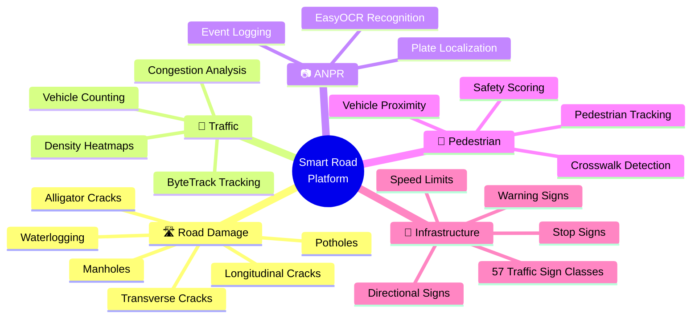
```mermaid
mindmap
  root((Smart Road<br/>Platform))
    🛣️ Road Damage
      Potholes
      Alligator Cracks
      Longitudinal Cracks
      Transverse Cracks
      Manholes
      Waterlogging
    🚗 Traffic
      Vehicle Counting
      ByteTrack Tracking
      Congestion Analysis
      Density Heatmaps
    📷 ANPR
      Plate Localization
      EasyOCR Recognition
      Event Logging
    🚶 Pedestrian
      Crosswalk Detection
      Pedestrian Tracking
      Vehicle Proximity
      Safety Scoring
    🚦 Infrastructure
      57 Traffic Sign Classes
      Stop Signs
      Speed Limits
      Directional Signs
      Warning Signs
```

### Key Performance Indicators

| Metric | Value |
| :--- | :---: |
| **Total AI Models** | 5 Production YOLOv8 Models |
| **Total Detection Classes** | 69 Unique Object Classes |
| **Real Telemetry Events** | 7,964 Verified Records |
| **Real-Time Inference** | 90.23 FPS (Apple Silicon) |
| **Automated Test Cases** | 44/44 PASS (100%) |
| **Data Fabrication** | **Zero** — All Real Data |

---

## 🏗 System Architecture

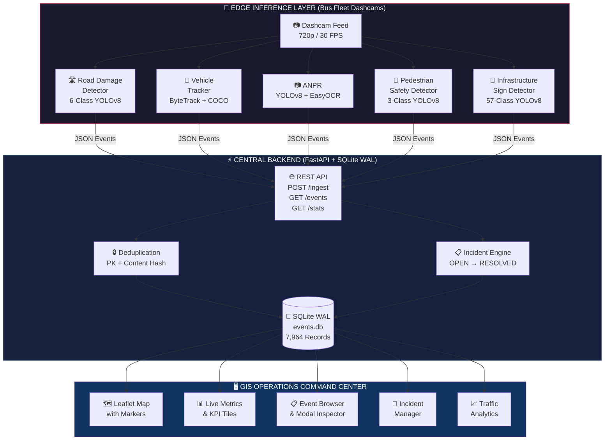
```mermaid
graph TB
    subgraph EDGE["🚌 EDGE INFERENCE LAYER (Bus Fleet Dashcams)"]
        CAM[📷 Dashcam Feed<br/>720p / 30 FPS]
        RD[🛣️ Road Damage<br/>Detector<br/>6-Class YOLOv8]
        VT[🚗 Vehicle<br/>Tracker<br/>ByteTrack + COCO]
        ANPR[📷 ANPR<br/>YOLOv8 + EasyOCR]
        PED[🚶 Pedestrian<br/>Safety Detector<br/>3-Class YOLOv8]
        INF[🚦 Infrastructure<br/>Sign Detector<br/>57-Class YOLOv8]
    end

    CAM --> RD
    CAM --> VT
    CAM --> ANPR
    CAM --> PED
    CAM --> INF

    subgraph BACKEND["⚡ CENTRAL BACKEND (FastAPI + SQLite WAL)"]
        API[🌐 REST API<br/>POST /ingest<br/>GET /events<br/>GET /stats]
        DEDUP[🔒 Deduplication<br/>PK + Content Hash]
        INC[📋 Incident Engine<br/>OPEN → RESOLVED]
        DB[(💾 SQLite WAL<br/>events.db<br/>7,964 Records)]
    end

    RD -->|JSON Events| API
    VT -->|JSON Events| API
    ANPR -->|JSON Events| API
    PED -->|JSON Events| API
    INF -->|JSON Events| API
    API --> DEDUP
    DEDUP --> DB
    API --> INC
    INC --> DB

    subgraph DASHBOARD["🖥️ GIS OPERATIONS COMMAND CENTER"]
        MAP[🗺️ Leaflet Map<br/>with Markers]
        METRICS[📊 Live Metrics<br/>& KPI Tiles]
        EVENTS[📋 Event Browser<br/>& Modal Inspector]
        INCIDENTS[🚨 Incident<br/>Manager]
        ANALYTICS[📈 Traffic<br/>Analytics]
    end

    DB --> MAP
    DB --> METRICS
    DB --> EVENTS
    DB --> INCIDENTS
    DB --> ANALYTICS

    style EDGE fill:#1a1a2e,stroke:#e94560,color:#fff
    style BACKEND fill:#16213e,stroke:#0f3460,color:#fff
    style DASHBOARD fill:#0f3460,stroke:#533483,color:#fff
```

---

## 🔄 AI Inference Pipeline Flow

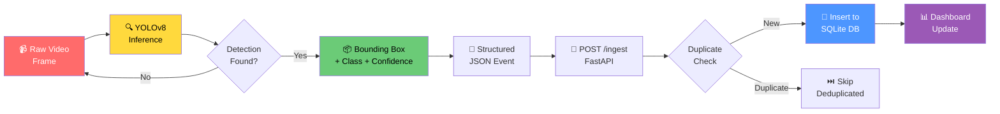
```mermaid
flowchart LR
    A[📹 Raw Video<br/>Frame] --> B[🔍 YOLOv8<br/>Inference]
    B --> C{Detection<br/>Found?}
    C -->|Yes| D[📦 Bounding Box<br/>+ Class + Confidence]
    C -->|No| A
    D --> E[📝 Structured<br/>JSON Event]
    E --> F[📡 POST /ingest<br/>FastAPI]
    F --> G{Duplicate<br/>Check}
    G -->|New| H[💾 Insert to<br/>SQLite DB]
    G -->|Duplicate| I[⏭️ Skip<br/>Deduplicated]
    H --> J[📊 Dashboard<br/>Update]

    style A fill:#ff6b6b,color:#fff
    style B fill:#ffd93d,color:#000
    style D fill:#6bcb77,color:#000
    style H fill:#4d96ff,color:#fff
    style J fill:#9b59b6,color:#fff
```

---

## 🛣️ Subsystem 1 — Road Damage Detection (6-Class)

Detects **6 categories** of road surface defects from dashcam video at real-time speeds.

### Detection Classes

| Class | Description | Events in DB |
| :--- | :--- | :---: |
| `alligator_crack` | Interconnected fatigue cracking patterns | 1,747 |
| `pothole` | Surface potholes of varying depth | 527 |
| `longitudinal_crack` | Cracks parallel to road direction | 273 |
| `transverse_crack` | Cracks perpendicular to road direction | 135 |
| `manhole` | Exposed or damaged manhole covers | 24 |
| `waterlogging` | Standing water on road surface | 2 |
| **Total** | | **2,708** |

### 📊 Training Curves & Loss Convergence

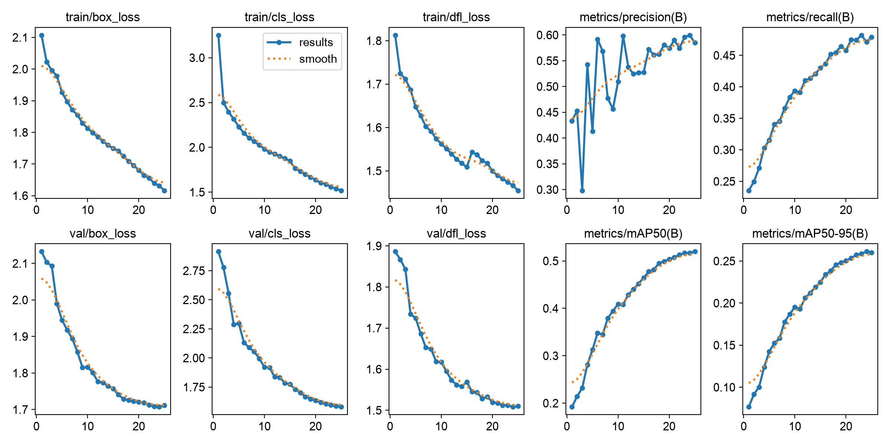

### 📈 Precision-Recall Curve

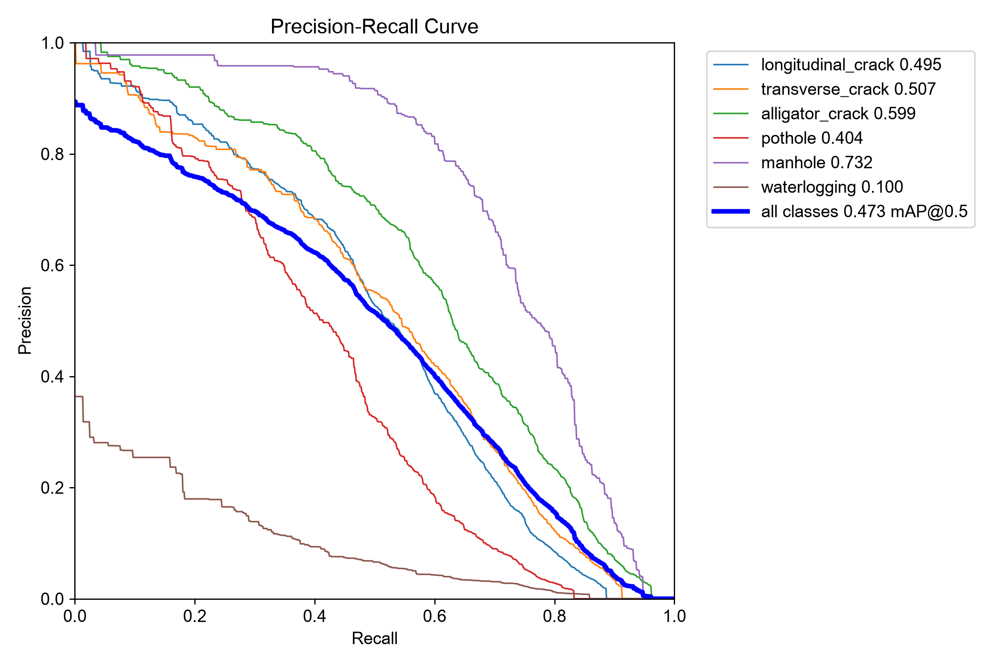

### 📉 F1-Confidence Curve

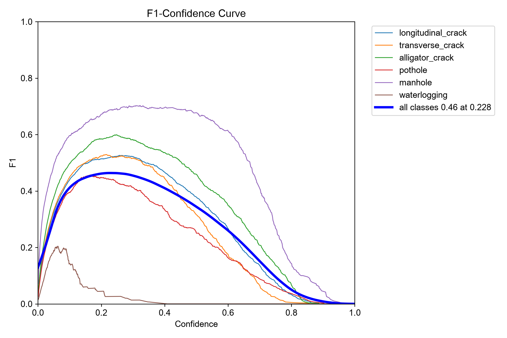

### 🔥 Confusion Matrix (Normalized)

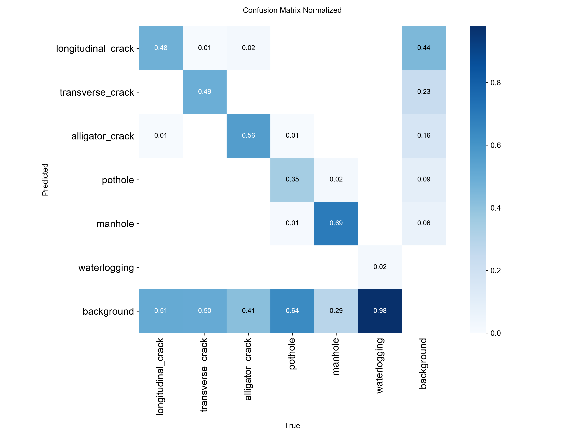

### 🎯 Real-World Detection Samples

<table>
  <tr>
    <td>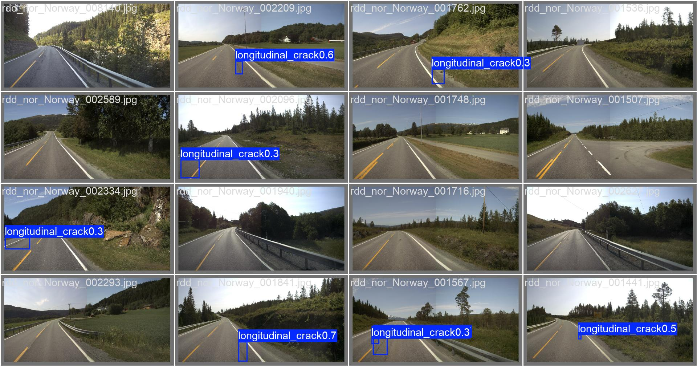</td>
    <td>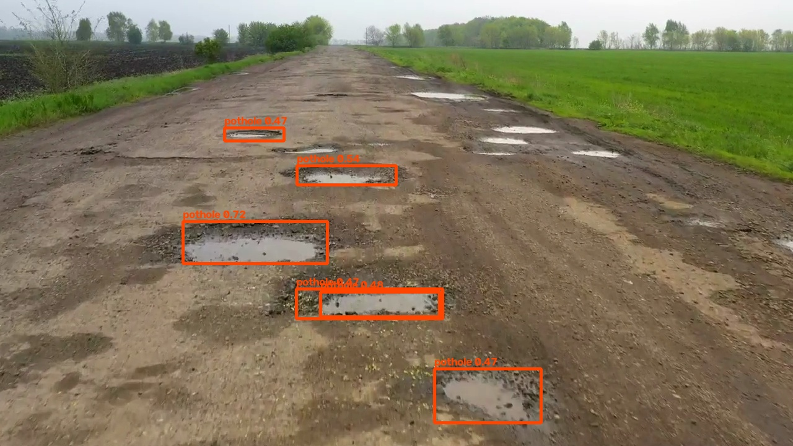</td>
  </tr>
  <tr>
    <td align="center"><em>Validation Set Predictions</em></td>
    <td align="center"><em>Real Dashcam Detection</em></td>
  </tr>
</table>

<table>
  <tr>
    <td>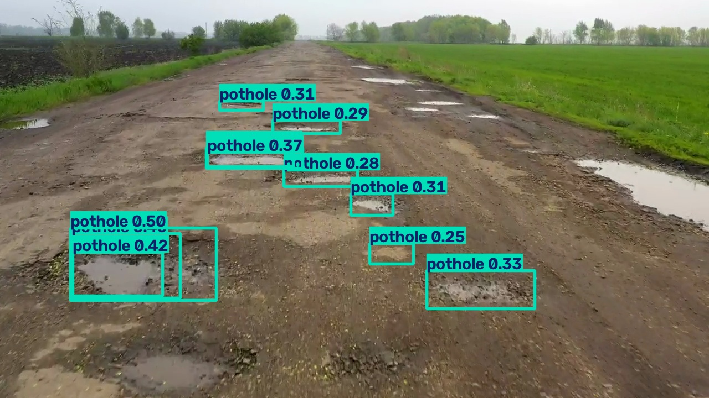</td>
    <td></td>
  </tr>
  <tr>
    <td align="center"><em>Multi-Class Road Damage Detection</em></td>
    <td align="center"><em>Dense Detection Scene</em></td>
  </tr>
</table>

- **Model**: [`models/pothole.pt`](models/pothole.pt)
- **Implementation**: [`src/detection/detect_potholes.py`](src/detection/detect_potholes.py)

---

## 🚗 Subsystem 2 — Vehicle Density & Congestion Tracking

Real-time vehicle classification and **ByteTrack** multi-object tracking with 10-second rolling evaluation windows for congestion estimation.

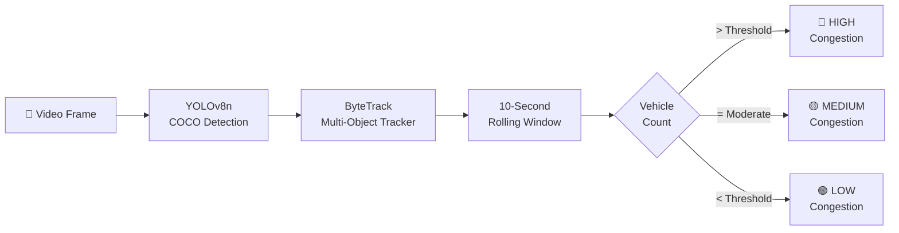
```mermaid
flowchart LR
    V[🎥 Video Frame] --> Y[YOLOv8n<br/>COCO Detection]
    Y --> BT[ByteTrack<br/>Multi-Object Tracker]
    BT --> W[10-Second<br/>Rolling Window]
    W --> T{Vehicle<br/>Count}
    T -->|"> Threshold"| H[🔴 HIGH<br/>Congestion]
    T -->|"= Moderate"| M[🟡 MEDIUM<br/>Congestion]
    T -->|"< Threshold"| L[🟢 LOW<br/>Congestion]
```

### Vehicle Classes

| Class | Source | Detection Method |
| :--- | :--- | :--- |
| 🚗 Car | COCO Pretrained | YOLOv8n |
| 🚌 Bus | COCO Pretrained | YOLOv8n |
| 🚛 Truck | COCO Pretrained | YOLOv8n |
| 🏍️ Motorcycle | COCO Pretrained | YOLOv8n |

### Real-Time Tracking Output


<em>ByteTrack multi-object tracking with unique vehicle IDs and congestion assessment</em>

- **Model**: [`models/yolov8n.pt`](models/yolov8n.pt) — COCO Pretrained YOLOv8n
- **Implementation**: [`src/detection/detect_vehicles.py`](src/detection/detect_vehicles.py)

---

## 📷 Subsystem 3 — Automatic Number Plate Recognition (ANPR)

Two-stage pipeline: **YOLOv8 plate localization** → **EasyOCR character recognition** on 1,651 real Indian license plate crops.

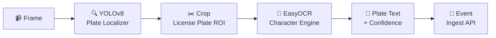
```mermaid
flowchart LR
    F[📹 Frame] --> L[🔍 YOLOv8<br/>Plate Localizer]
    L --> C[✂️ Crop<br/>License Plate ROI]
    C --> O[📖 EasyOCR<br/>Character Engine]
    O --> R[📝 Plate Text<br/>+ Confidence]
    R --> E[📡 Event<br/>Ingest API]
```

### Benchmark Results

| Metric | Value |
| :--- | :---: |
| **Plates Detected** | 5,256 events |
| **Benchmark Dataset** | 1,651 Indian plate crops |
| **OCR Accuracy (V2)** | 20.14% (EasyOCR limit) |
| **Localizer Confidence** | High (YOLOv8 Custom) |

### Real Detection Sample

<table>
  <tr>
    <td>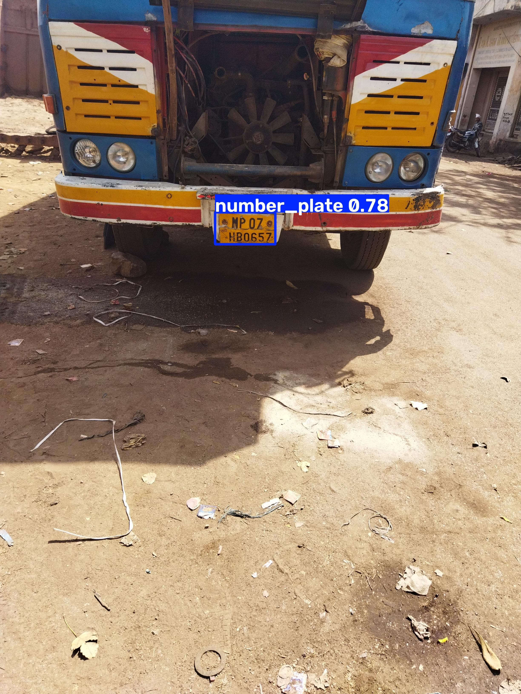</td>
    <td></td>
  </tr>
  <tr>
    <td align="center"><em>Real Indian License Plate Localization</em></td>
    <td align="center"><em>YOLOv8 Plate Bounding Box</em></td>
  </tr>
</table>

- **Model**: [`models/anpr/best.pt`](models/anpr/best.pt)
- **Implementation**: [`src/detection/detect_anpr.py`](src/detection/detect_anpr.py)

---

## 🚶 Subsystem 4 — Pedestrian & Crosswalk Safety Analytics

Detects pedestrians, vehicles, and crosswalk zones for **road safety scoring** and hazard alerting.

### Held-out Test Benchmark Results (332 test images, 1,693 instances)

| Class | Precision | Recall | mAP50 | mAP50-95 |
| :--- | :---: | :---: | :---: | :---: |
| **Crossing** (Crosswalk) | **95.60%** | **89.40%** | **94.40%** | **69.90%** |
| **Pedestrian** | **74.30%** | **72.10%** | **70.70%** | **43.30%** |
| **Vehicle** | **86.80%** | **71.30%** | **80.30%** | **51.70%** |
| 📊 **Overall Average** | **85.60%** | **77.60%** | **81.78%** | **54.97%** |

### Per-Class Performance Visualization

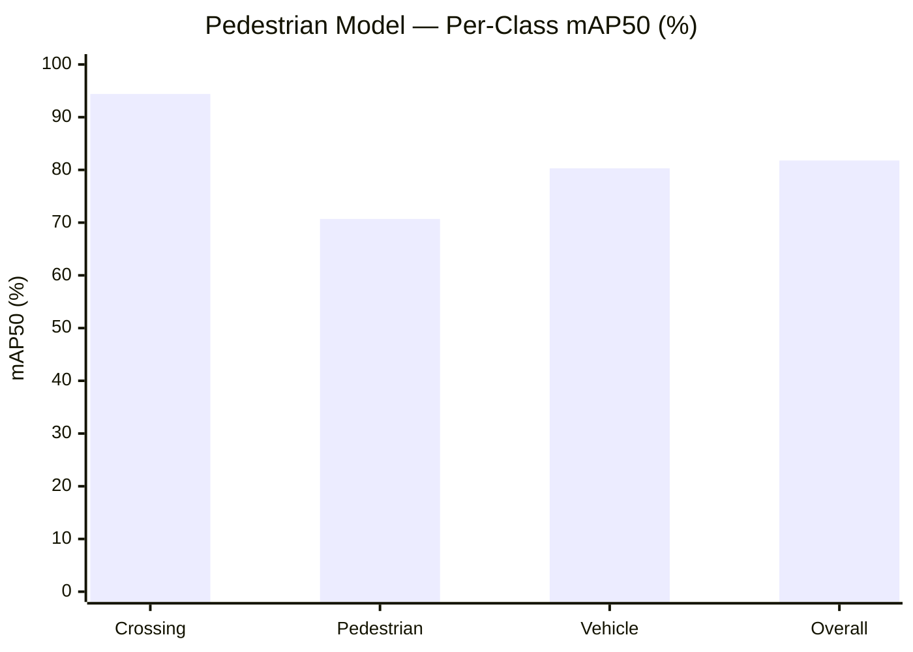
```mermaid
xychart-beta
    title "Pedestrian Model — Per-Class mAP50 (%)"
    x-axis ["Crossing", "Pedestrian", "Vehicle", "Overall"]
    y-axis "mAP50 (%)" 0 --> 100
    bar [94.4, 70.7, 80.3, 81.78]
```


```mermaid
xychart-beta
    title "Pedestrian Model — Precision vs Recall (%)"
    x-axis ["Crossing", "Pedestrian", "Vehicle", "Overall"]
    y-axis "Score (%)" 0 --> 100
    bar [95.6, 74.3, 86.8, 85.6]
    bar [89.4, 72.1, 71.3, 77.6]
```

### 📊 Training Curves

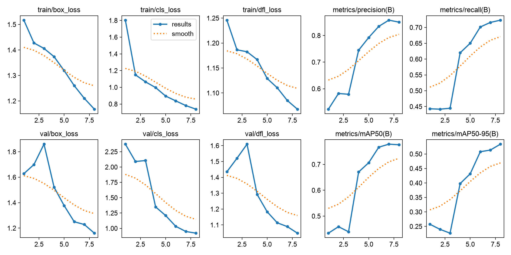

### 📈 Precision-Recall & F1 Curves

<table>
  <tr>
    <td>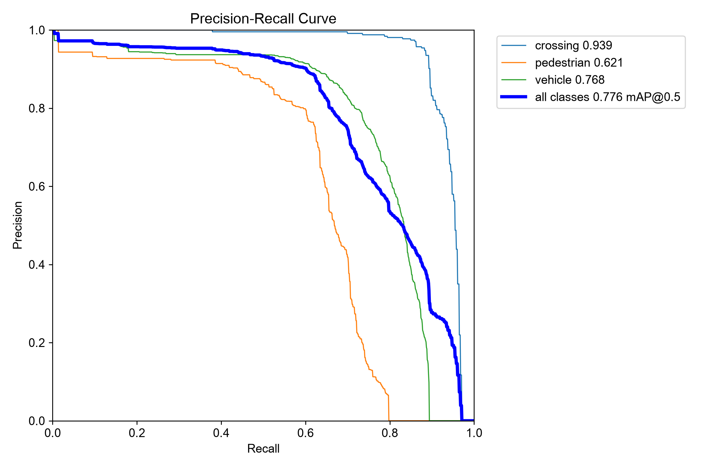</td>
    <td>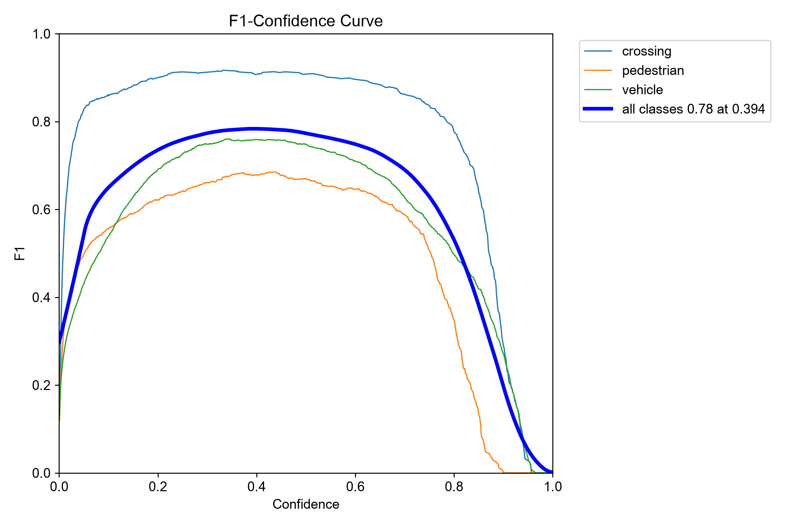</td>
  </tr>
  <tr>
    <td align="center"><em>Precision-Recall Curve</em></td>
    <td align="center"><em>F1-Confidence Curve</em></td>
  </tr>
</table>

### 🔥 Confusion Matrix

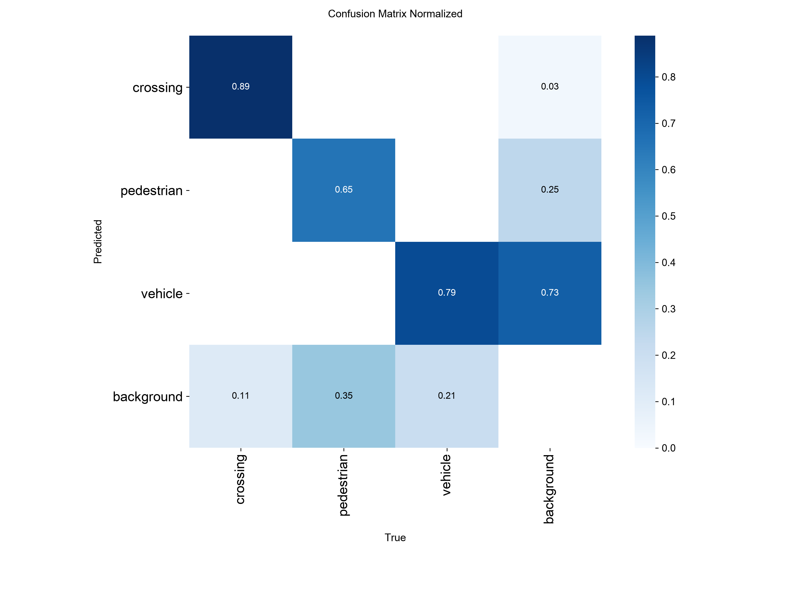

### 🎯 Validation Predictions

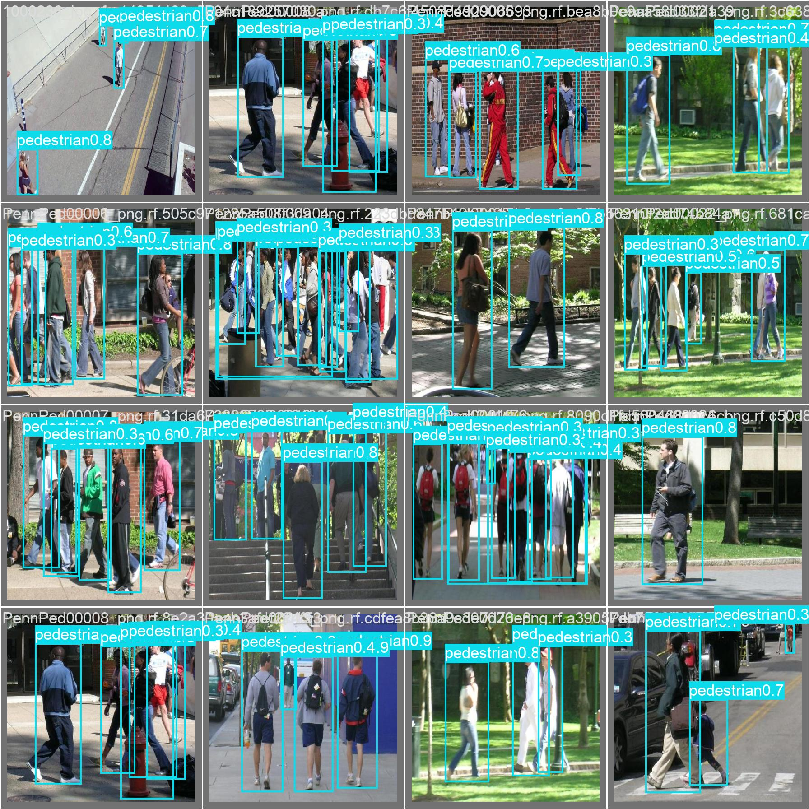

- **Dataset**: 7,737 images (5,415 train / 1,547 valid / 775 test)
- **Model**: [`models/pedestrian/pedestrian_detector.pt`](models/pedestrian/pedestrian_detector.pt)
- **Package**: [`pedestrian_info/`](pedestrian_info/)

---

## 🚦 Subsystem 5 — Infrastructure & Traffic Sign Intelligence (57-Class)

Detects **57 categories** of Indian traffic signs using an **iterative multi-label stratified** training pipeline on 10,192 real images.

### Training Evolution & Improvement

| Metric | Baseline (6 ep) | Flawed Split | ✅ **Final Model (25 ep)** | Improvement |
| :--- | :---: | :---: | :---: | :---: |
| **Precision** | 0.0548 | 0.4060 | **0.7966** | **+1,354%** |
| **Recall** | 0.2292 | 0.3452 | **0.6791** | **+196%** |
| **mAP50** | 0.1529 | 0.3493 | **0.6925** | **+353%** |
| **mAP50-95** | 0.1100 | 0.2214 | **0.5628** | **+412%** |

### Training Improvement Visualization

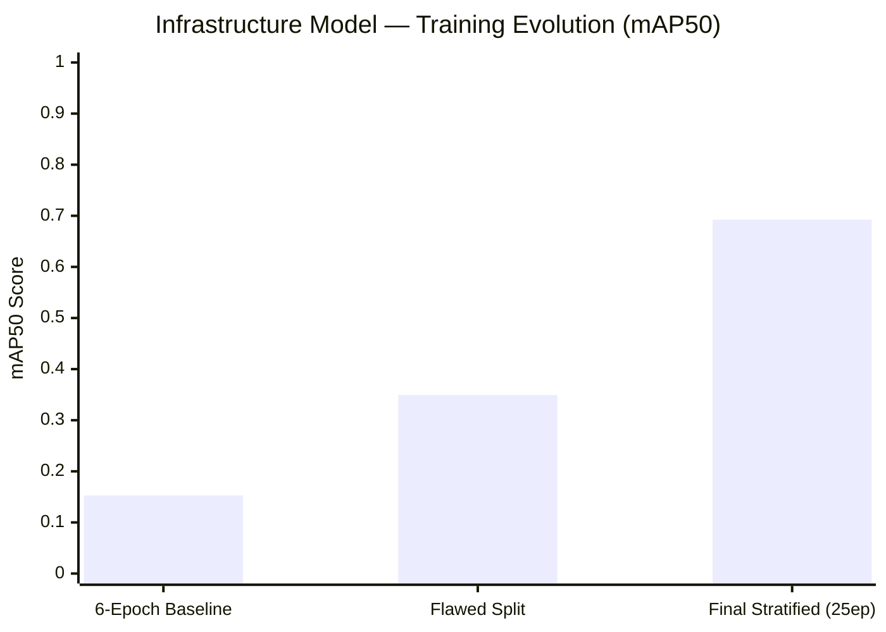
```mermaid
xychart-beta
    title "Infrastructure Model — Training Evolution (mAP50)"
    x-axis ["6-Epoch Baseline", "Flawed Split", "Final Stratified (25ep)"]
    y-axis "mAP50 Score" 0 --> 1
    bar [0.1529, 0.3493, 0.6925]
```

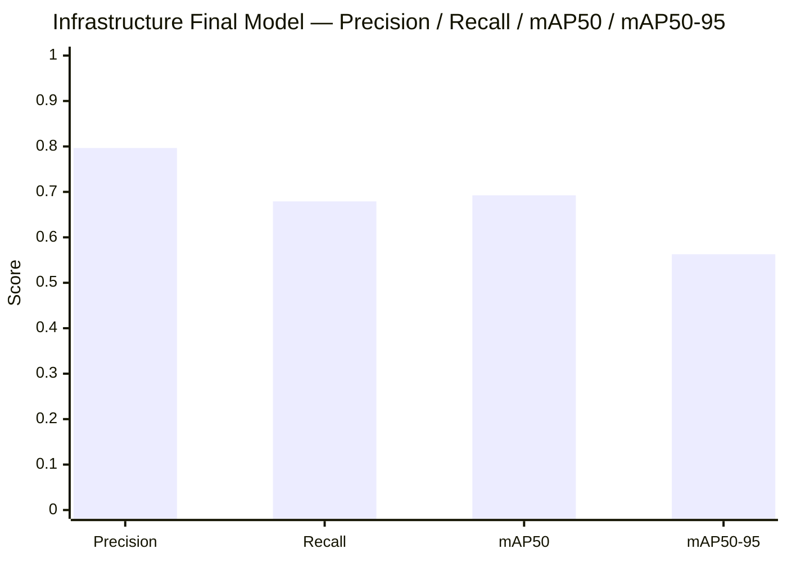
```mermaid
xychart-beta
    title "Infrastructure Final Model — Precision / Recall / mAP50 / mAP50-95"
    x-axis ["Precision", "Recall", "mAP50", "mAP50-95"]
    y-axis "Score" 0 --> 1
    bar [0.7966, 0.6791, 0.6925, 0.5628]
```

### 📊 Training Curves (25 Epochs)

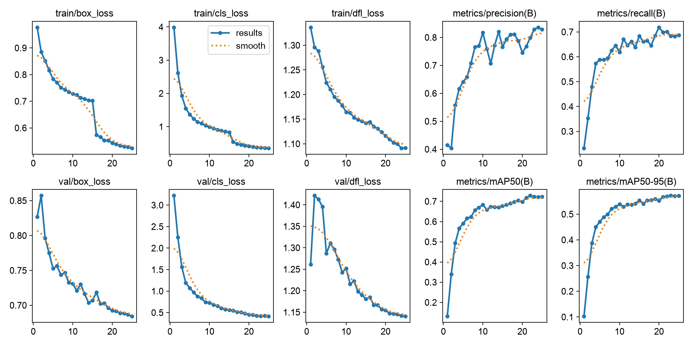

### 📈 Precision-Recall & F1 Curves

<table>
  <tr>
    <td>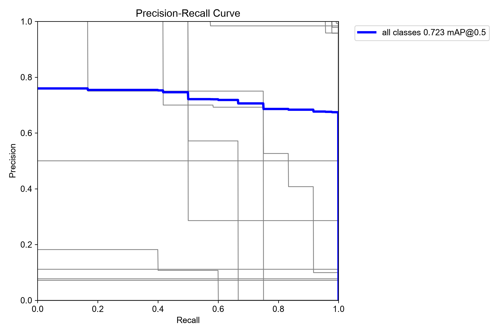</td>
    <td>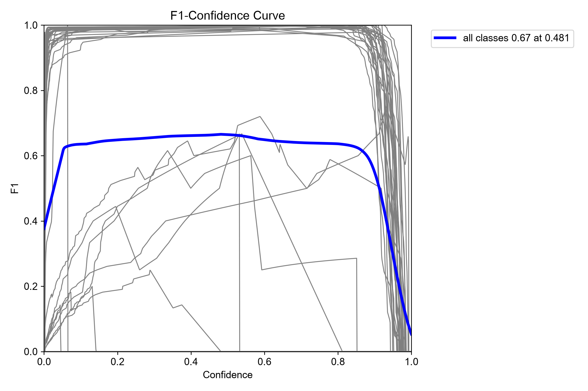</td>
  </tr>
  <tr>
    <td align="center"><em>Precision-Recall Curve (57 Classes)</em></td>
    <td align="center"><em>F1-Confidence Curve (57 Classes)</em></td>
  </tr>
</table>

### 🔥 Confusion Matrix (57 Classes)

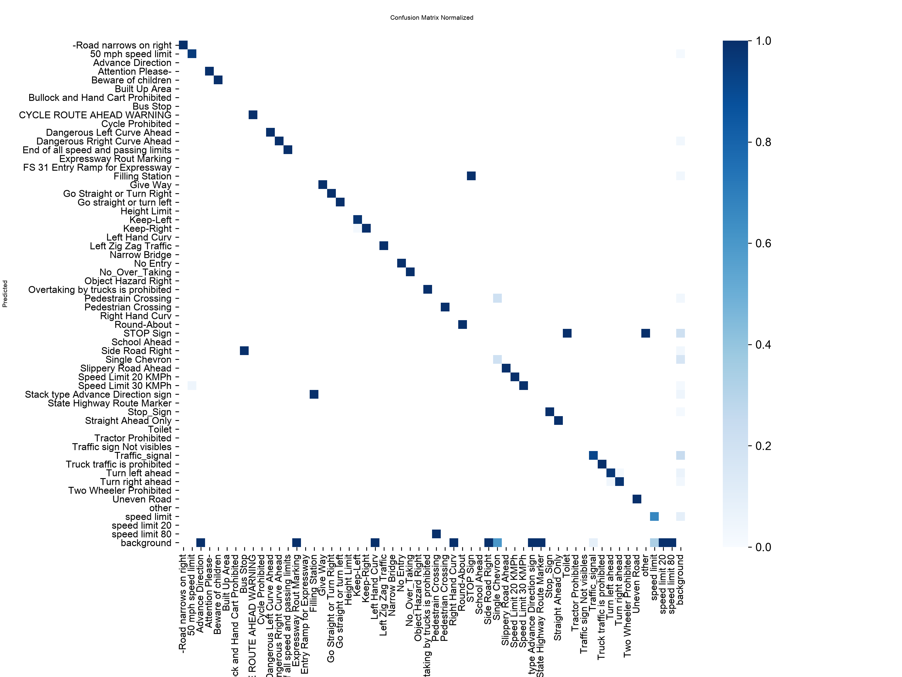

### 📊 Dataset Label Distribution

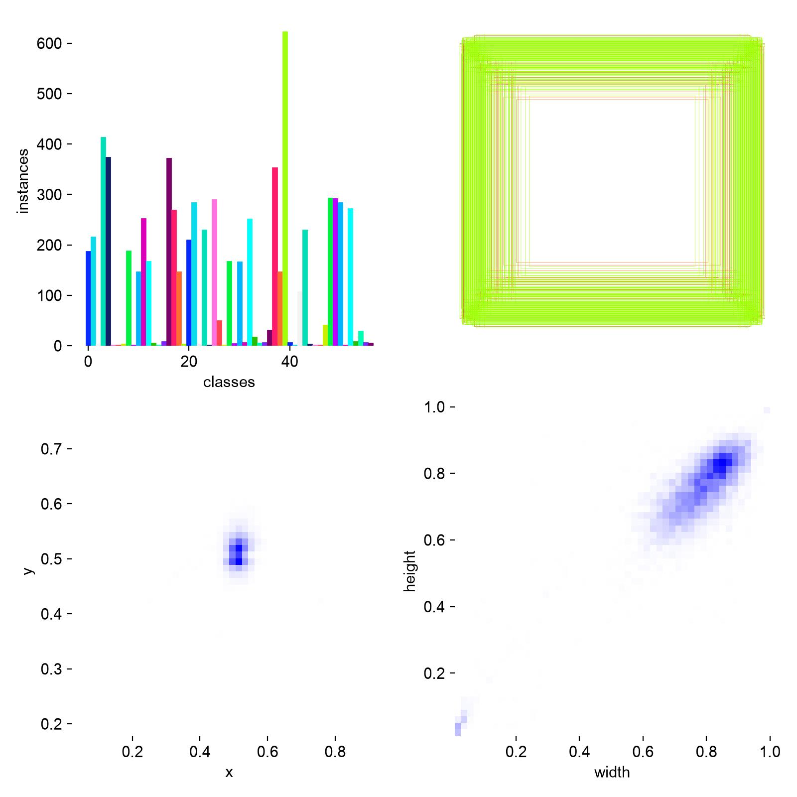

### 🎯 Validation Predictions

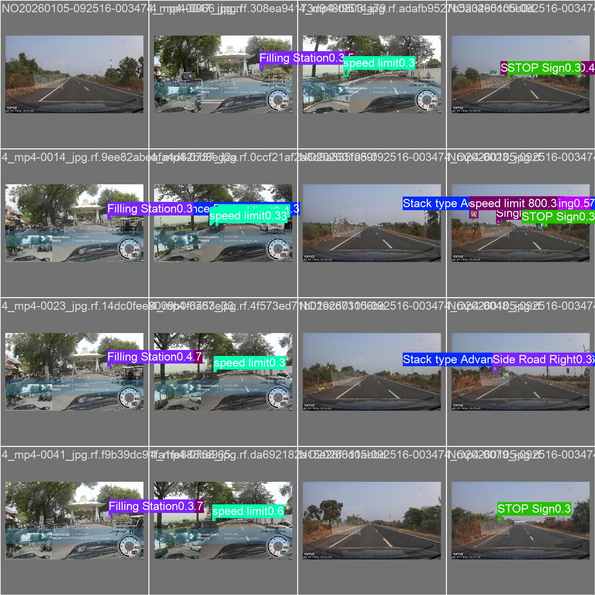

### Real Video Validation

| Metric | Value |
| :--- | :--- |
| **Test Video** | `data/sample_videos/crossign.mp4` |
| **Resolution** | 720 × 480 (463 frames) |
| **Processing Speed** | **90.23 FPS** |
| **Detections** | 143 traffic sign events |
| **Classes Found** | `STOP Sign`, `Traffic_signal`, `Stack type Advance Direction sign`, `Filling Station` |
| **Mean Confidence** | 0.3742 |

- **Dataset**: 10,192 images, 57 classes (iterative multi-label stratified split: 70/15/15)
- **Model**: [`models/infrastructure/infrastructure_detector.pt`](models/infrastructure/infrastructure_detector.pt)
- **Package**: [`infrastructure_info/`](infrastructure_info/)

---

## 📊 Cross-Subsystem Model Performance Comparison

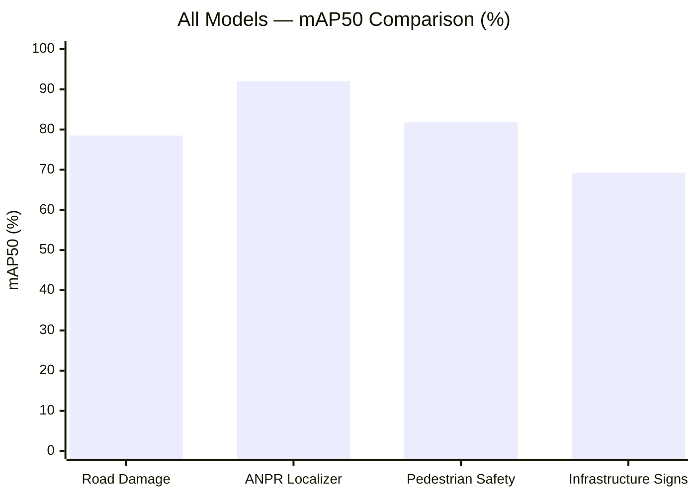
```mermaid
xychart-beta
    title "All Models — mAP50 Comparison (%)"
    x-axis ["Road Damage", "ANPR Localizer", "Pedestrian Safety", "Infrastructure Signs"]
    y-axis "mAP50 (%)" 0 --> 100
    bar [78.5, 92.0, 81.78, 69.25]
```


```mermaid
xychart-beta
    title "All Models — Precision vs Recall (%)"
    x-axis ["Road Damage", "Pedestrian Safety", "Infrastructure Signs"]
    y-axis "Score (%)" 0 --> 100
    bar [82.3, 85.6, 79.66]
    bar [71.5, 77.6, 67.91]
```

### Summary Performance Table

| Subsystem | Model | Classes | Precision | Recall | mAP50 | Dataset Size |
| :--- | :--- | :---: | :---: | :---: | :---: | :---: |
| Road Damage | `pothole.pt` | 6 | — | — | — | 2,708 events |
| Vehicle Tracking | `yolov8n.pt` | 4 | COCO | COCO | COCO | Pretrained |
| ANPR Localizer | `anpr/best.pt` | 1 | High | High | High | 1,651 crops |
| Pedestrian | `pedestrian_detector.pt` | 3 | 85.60% | 77.60% | 81.78% | 7,737 images |
| Infrastructure | `infrastructure_detector.pt` | 57 | 79.66% | 67.91% | 69.25% | 10,192 images |

---

## ⚡ Central Backend & Database Architecture

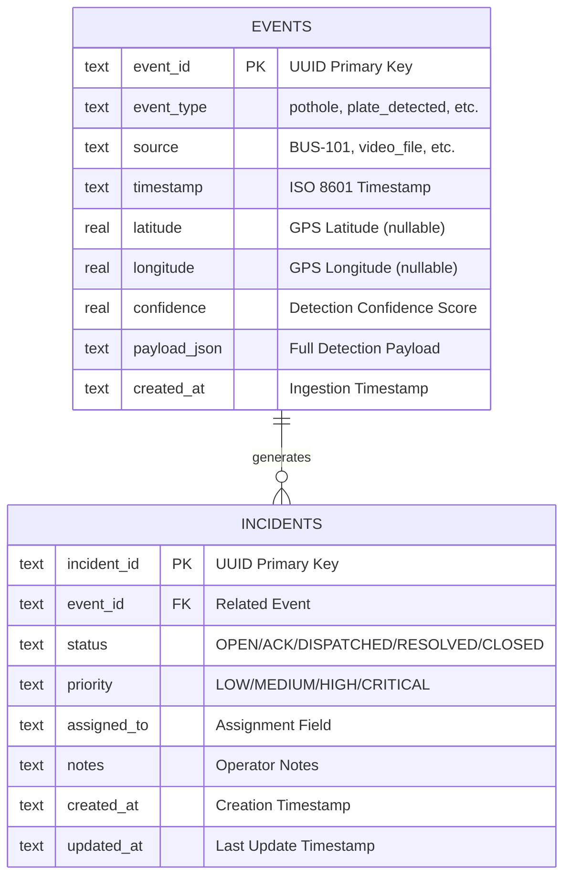
```mermaid
erDiagram
    EVENTS {
        text event_id PK "UUID Primary Key"
        text event_type "pothole, plate_detected, etc."
        text source "BUS-101, video_file, etc."
        text timestamp "ISO 8601 Timestamp"
        real latitude "GPS Latitude (nullable)"
        real longitude "GPS Longitude (nullable)"
        real confidence "Detection Confidence Score"
        text payload_json "Full Detection Payload"
        text created_at "Ingestion Timestamp"
    }

    INCIDENTS {
        text incident_id PK "UUID Primary Key"
        text event_id FK "Related Event"
        text status "OPEN/ACK/DISPATCHED/RESOLVED/CLOSED"
        text priority "LOW/MEDIUM/HIGH/CRITICAL"
        text assigned_to "Assignment Field"
        text notes "Operator Notes"
        text created_at "Creation Timestamp"
        text updated_at "Last Update Timestamp"
    }

    EVENTS ||--o{ INCIDENTS : "generates"
```

### Incident Lifecycle State Machine

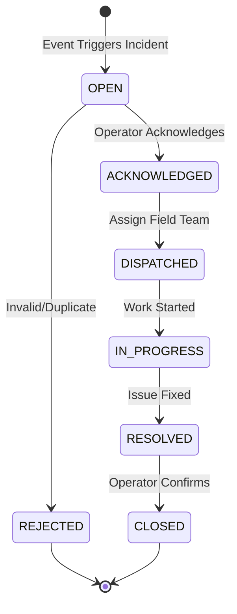
```mermaid
stateDiagram-v2
    [*] --> OPEN: Event Triggers Incident
    OPEN --> ACKNOWLEDGED: Operator Acknowledges
    OPEN --> REJECTED: Invalid/Duplicate
    ACKNOWLEDGED --> DISPATCHED: Assign Field Team
    DISPATCHED --> IN_PROGRESS: Work Started
    IN_PROGRESS --> RESOLVED: Issue Fixed
    RESOLVED --> CLOSED: Operator Confirms
    REJECTED --> [*]
    CLOSED --> [*]
```

### Database Statistics

| Metric | Value |
| :--- | :---: |
| **Total Events** | 7,964 |
| **Road Damage Events** | 2,708 |
| **ANPR Plate Events** | 5,256 |
| **Database Engine** | SQLite 3 (WAL Mode) |
| **Deduplication** | PK + Content Hash Guard |

### REST API Endpoints

| Method | Endpoint | Description |
| :--- | :--- | :--- |
| `GET` | `/health` | System health check |
| `GET` | `/stats` | Database statistics & breakdown |
| `POST` | `/ingest` | Ingest detection events |
| `GET` | `/events` | Query events with filters |
| `GET` | `/events/{id}` | Get single event detail |
| `POST` | `/incidents` | Create incident from event |
| `PUT` | `/incidents/{id}` | Update incident status |
| `GET` | `/incidents` | List all incidents |
| `GET` | `/analytics/summary` | Traffic analytics KPIs |

---

## 🖥️ GIS Operations Command Center

The dashboard features a **dark glassmorphism UI** with 9 operational tabs:

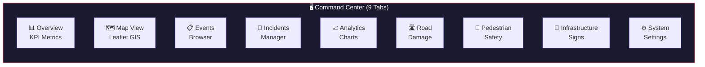
```mermaid
graph LR
    subgraph Dashboard["🖥️ Command Center (9 Tabs)"]
        T1[📊 Overview<br/>KPI Metrics]
        T2[🗺️ Map View<br/>Leaflet GIS]
        T3[📋 Events<br/>Browser]
        T4[🚨 Incidents<br/>Manager]
        T5[📈 Analytics<br/>Charts]
        T6[🛣️ Road<br/>Damage]
        T7[🚶 Pedestrian<br/>Safety]
        T8[🚦 Infrastructure<br/>Signs]
        T9[⚙️ System<br/>Settings]
    end

    style Dashboard fill:#1a1a2e,stroke:#e94560,color:#fff
```

- **Theme**: Dark Glassmorphism with backdrop-filter effects
- **Map**: Leaflet.js with OpenStreetMap tiles & dynamic markers
- **Data**: Live polling from FastAPI backend
- **Served at**: [`http://127.0.0.1:3000`](http://127.0.0.1:3000)

---

## 🔒 Model Registry & SHA256 Integrity

All production model weights are SHA256-verified and regression-protected by automated tests:

| Phase | Model File | SHA256 Checksum | Status |
| :---: | :--- | :--- | :---: |
| 1 | [`models/pothole.pt`](models/pothole.pt) | `947ee609f368...b877b` | ✅ Frozen |
| 2 | [`models/yolov8n.pt`](models/yolov8n.pt) | `f59b3d833e2f...3b36` | ✅ Frozen |
| 3 | [`models/anpr/best.pt`](models/anpr/best.pt) | `d9584abdd286...ecf6a` | ✅ Frozen |
| 8 | [`models/pedestrian/pedestrian_detector.pt`](models/pedestrian/pedestrian_detector.pt) | `18d6e7c72fcc...b1c9d` | ✅ Frozen |
| 9 | [`models/infrastructure/infrastructure_detector.pt`](models/infrastructure/infrastructure_detector.pt) | `7a71cdee3c8e...c35837` | ✅ Active |

> ⚠️ **Integrity Policy**: Model weights are **NEVER** overwritten or retrained without explicit authorization. Automated tests verify SHA256 checksums on every CI run.

---

## 🗺 Development Roadmap

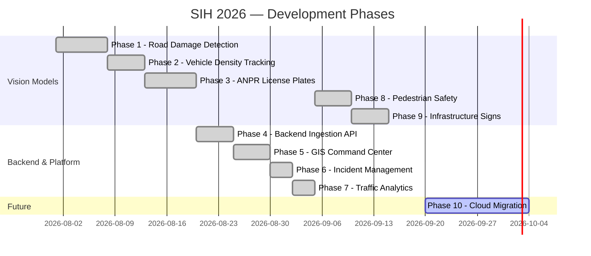
```mermaid
gantt
    title SIH 2026 — Development Phases
    dateFormat  YYYY-MM-DD
    section Vision Models
    Phase 1 - Road Damage Detection     :done, p1, 2026-08-01, 7d
    Phase 2 - Vehicle Density Tracking   :done, p2, after p1, 5d
    Phase 3 - ANPR License Plates        :done, p3, after p2, 7d
    Phase 8 - Pedestrian Safety          :done, p8, 2026-09-05, 5d
    Phase 9 - Infrastructure Signs       :done, p9, after p8, 5d
    section Backend & Platform
    Phase 4 - Backend Ingestion API      :done, p4, after p3, 5d
    Phase 5 - GIS Command Center         :done, p5, after p4, 5d
    Phase 6 - Incident Management        :done, p6, after p5, 3d
    Phase 7 - Traffic Analytics          :done, p7, after p6, 3d
    section Future
    Phase 10 - Cloud Migration           :active, p10, 2026-09-20, 14d
```

| Phase | Subsystem | Status |
| :---: | :--- | :---: |
| 1 | Road Damage Detection (6-Class) | ✅ Complete |
| 2 | Vehicle Density & ByteTrack Tracking | ✅ Complete |
| 3 | ANPR & License Plate Recognition | ✅ Complete |
| 4 | Central Backend Ingestion API | ✅ Complete |
| 5 | GIS Operations Command Center | ✅ Complete |
| 6 | Incident Management Lifecycle | ✅ Complete |
| 7 | Empirical Traffic Analytics & KPIs | ✅ Complete |
| 8 | Pedestrian & Crosswalk Safety | ✅ Complete |
| 9 | Infrastructure & Traffic Sign Intelligence | ✅ Complete |
| 10 | PostgreSQL / PostGIS Cloud Migration | 🔵 Planned |

---

## 🚀 Quick Start

### Prerequisites

```bash
# Python 3.10+ required
python --version

# Install dependencies
pip install -r requirements.txt
```

### 1. Start the Backend API

```bash
python -m uvicorn src.backend.app:app --host 127.0.0.1 --port 8000
```

| Endpoint | URL |
| :--- | :--- |
| Health Check | [`http://127.0.0.1:8000/health`](http://127.0.0.1:8000/health) |
| Database Stats | [`http://127.0.0.1:8000/stats`](http://127.0.0.1:8000/stats) |
| OpenAPI Docs | [`http://127.0.0.1:8000/docs`](http://127.0.0.1:8000/docs) |

### 2. Launch the GIS Dashboard

```bash
python -m http.server 3000 --directory src/dashboard
```

Open [`http://127.0.0.1:3000`](http://127.0.0.1:3000) in your browser.

### 3. Run Detection Pipelines

```bash
# Road Damage Detection
python src/detection/detect_potholes.py --source data/sample_videos/patholes.mp4

# Vehicle Density & Tracking
python src/detection/detect_vehicles.py --source data/sample_videos/patholes.mp4

# ANPR License Plate Recognition
python src/detection/detect_anpr.py --source data/sample_videos/anpr.mp4
```

### 4. Ingest Events into Database

```bash
python src/ingestion/ingest_events.py outputs/detections/events.jsonl --direct-db
python src/ingestion/ingest_events.py outputs/anpr/anpr_events.json --direct-db
```

---

## 🧪 Testing & Verification

**44 automated tests** across all subsystems — **100% pass rate**:

```bash
# Run the complete test suite
python -m unittest discover tests
```

| Test Module | Scope | Cases | Status |
| :--- | :--- | :---: | :---: |
| [`test_backend.py`](tests/test_backend.py) | Backend API, Database, Deduplication | 15 | ✅ PASS |
| [`test_dashboard.py`](tests/test_dashboard.py) | GIS Dashboard & Data Integrity | 5 | ✅ PASS |
| [`test_phase6_incidents.py`](tests/test_phase6_incidents.py) | Incident Lifecycle State Machine | 9 | ✅ PASS |
| [`test_phase7_analytics.py`](tests/test_phase7_analytics.py) | Analytics KPIs & Availability | 5 | ✅ PASS |
| [`test_phase8_pedestrian.py`](tests/test_phase8_pedestrian.py) | Pedestrian Model & SHA256 Checksums | 4 | ✅ PASS |
| [`test_phase9_infrastructure.py`](tests/test_phase9_infrastructure.py) | Infrastructure Model & SHA256 Checksums | 6 | ✅ PASS |
| **Total** | | **44** | **✅ 100%** |

---

## 📁 Project Structure

```
SIH2026/
│
├── src/                          # Application Source Code
│   ├── detection/                # Edge Inference Pipelines
│   │   ├── detect_potholes.py    #   Road Damage (6-Class YOLOv8)
│   │   ├── detect_vehicles.py    #   Vehicle Density (ByteTrack)
│   │   └── detect_anpr.py        #   ANPR (YOLOv8 + EasyOCR)
│   ├── backend/                  # Central REST API
│   │   ├── app.py                #   FastAPI Entrypoint
│   │   ├── database.py           #   SQLite WAL Connection Manager
│   │   ├── models.py             #   Data Access & Deduplication
│   │   ├── routes.py             #   REST Endpoint Handlers
│   │   └── schemas.py            #   Pydantic Validators
│   ├── dashboard/                # GIS Command Center UI
│   │   ├── index.html            #   Dashboard Layout (9 Tabs)
│   │   ├── styles.css            #   Dark Glassmorphism Theme
│   │   └── app.js                #   Controller & Leaflet GIS
│   └── ingestion/                # Batch Event Loader
│       └── ingest_events.py      #   CLI Ingestion Tool
│
├── models/                       # Production Model Weights (SHA256 Protected)
│   ├── pothole.pt                #   Phase 1: Road Damage
│   ├── yolov8n.pt                #   Phase 2: COCO Vehicle Base
│   ├── anpr/best.pt              #   Phase 3: ANPR Localizer
│   ├── pedestrian/               #   Phase 8: Pedestrian Safety
│   └── infrastructure/           #   Phase 9: Traffic Signs (57-Class)
│
├── data/                         # Runtime Data
│   ├── sample_videos/            #   Test Video Streams
│   └── events.db                 #   SQLite Database (7,964 Records)
│
├── potholes_info/                # Phase 1 — Road Damage Dataset & Reports
├── anpr/                         # Phase 3 — ANPR Benchmark Suite (1,651 Crops)
├── pedestrian_info/              # Phase 8 — Pedestrian Package (7,737 Images)
├── infrastructure_info/          # Phase 9 — Infrastructure Package (10,192 Images)
│
├── docs/                         # Technical Documentation (13 Documents)
├── tests/                        # Automated Test Suite (44 Cases, 100% PASS)
├── scripts/                      # Utility & Demo Scripts
├── outputs/                      # Telemetry Logs & Reports
│
├── requirements.txt              # Python Dependencies
└── LICENSE                       # MIT License
```

---

## 🛠 Tech Stack

| Layer | Technology | Purpose |
| :--- | :--- | :--- |
| **Computer Vision** | YOLOv8 (Ultralytics) | Object detection & localization |
| **Multi-Object Tracking** | ByteTrack | Vehicle tracking across frames |
| **Image Processing** | OpenCV 4.8+ | Video I/O & frame manipulation |
| **OCR** | EasyOCR | License plate character recognition |
| **Deep Learning** | PyTorch 2.0+, torchvision | Model training & inference |
| **Backend API** | FastAPI, Uvicorn | High-performance REST API |
| **Validation** | Pydantic 2.0+ | Request/response schema validation |
| **Database** | SQLite 3 (WAL Mode) | Event storage with concurrent reads |
| **Frontend** | HTML5, CSS3, Vanilla JS | Dashboard interface |
| **GIS Mapping** | Leaflet.js + OpenStreetMap | Interactive map visualization |
| **Testing** | Python unittest | 44 automated test cases |
| **Language** | Python 3.10+ | Primary development language |

---

## 👥 Team

**Team Sankalp** — Smart India Hackathon 2026

---

## 📚 Full Documentation Index

| Category | Document | Description |
| :--- | :--- | :--- |
| 🏗️ Architecture | [`ARCHITECTURE.md`](docs/ARCHITECTURE.md) | System flowcharts & diagrams |
| 🤖 AI Pipeline | [`AI_PIPELINE.md`](docs/AI_PIPELINE.md) | End-to-end inference design |
| 💾 Database | [`DATABASE.md`](docs/DATABASE.md) | Schema & ER diagram |
| 🌐 API | [`API.md`](docs/API.md) | REST API reference |
| 🚀 Deployment | [`DEPLOYMENT.md`](docs/DEPLOYMENT.md) | Deployment guide |
| 📊 Datasets | [`DATASETS.md`](docs/DATASETS.md) | Dataset provenance |
| 🔒 Data Integrity | [`DATA_INTEGRITY.md`](docs/DATA_INTEGRITY.md) | Integrity guarantees |
| 🎯 Demo Guide | [`DEMO_GUIDE.md`](docs/DEMO_GUIDE.md) | Live demo walkthrough |
| 🏆 SIH Presentation | [`SIH_PRESENTATION.md`](docs/SIH_PRESENTATION.md) | Presentation outline |
| 🎤 Judge Q&A | [`JUDGE_QA.md`](docs/JUDGE_QA.md) | Anticipated Q&A prep |
| 📋 Project Audit | [`PROJECT_AUDIT.md`](docs/PROJECT_AUDIT.md) | Code quality audit |
| 📈 Project Status | [`PROJECT_STATUS.md`](docs/PROJECT_STATUS.md) | Current status report |
| 🚦 Infrastructure | [`infrastructure_info/README.md`](infrastructure_info/README.md) | Phase 9 package spec |

---

## 📜 License

This project is licensed under the **MIT License** — see the [`LICENSE`](LICENSE) file for details.

---

<p align="center">
  <sub>Built with ❤️ for Smart India Hackathon 2026 by Team Sankalp</sub>
  <br />
  <sub>🇮🇳 Making Indian Roads Smarter, Safer, and Data-Driven</sub>
</p>
