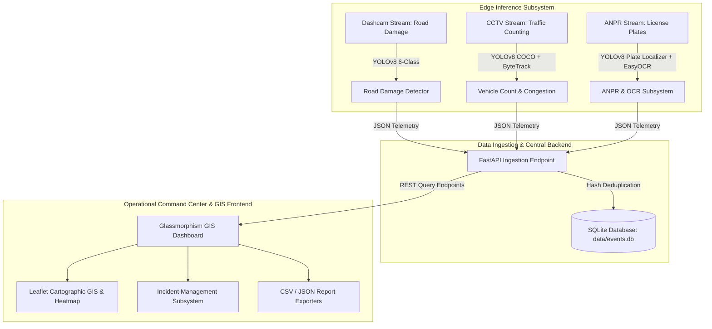
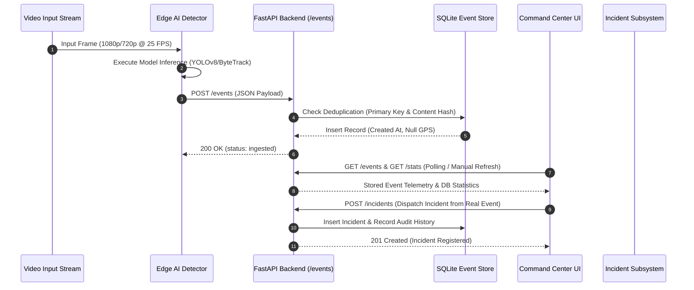
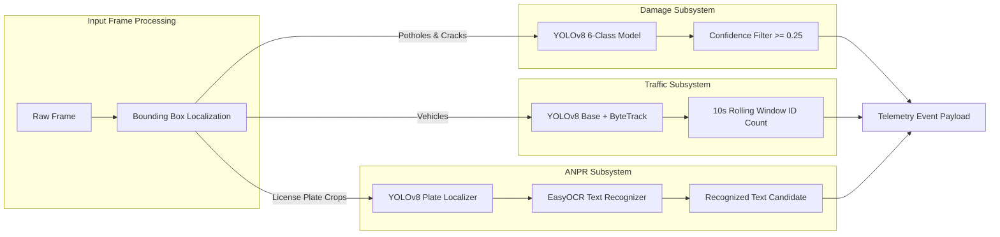
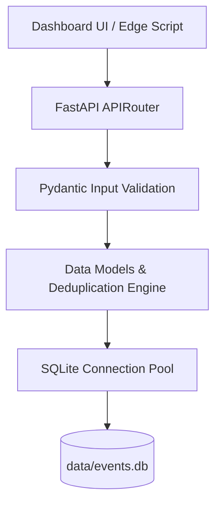
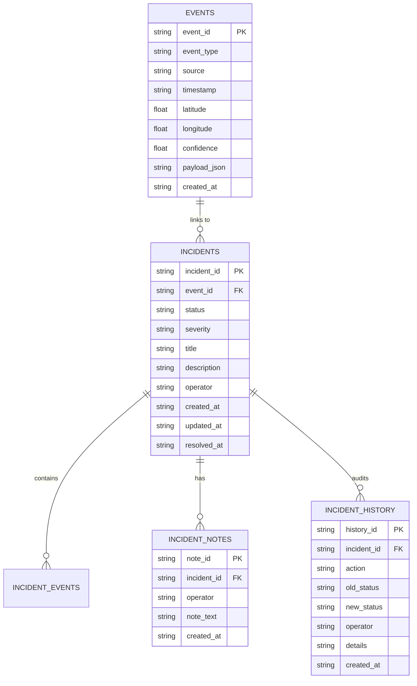
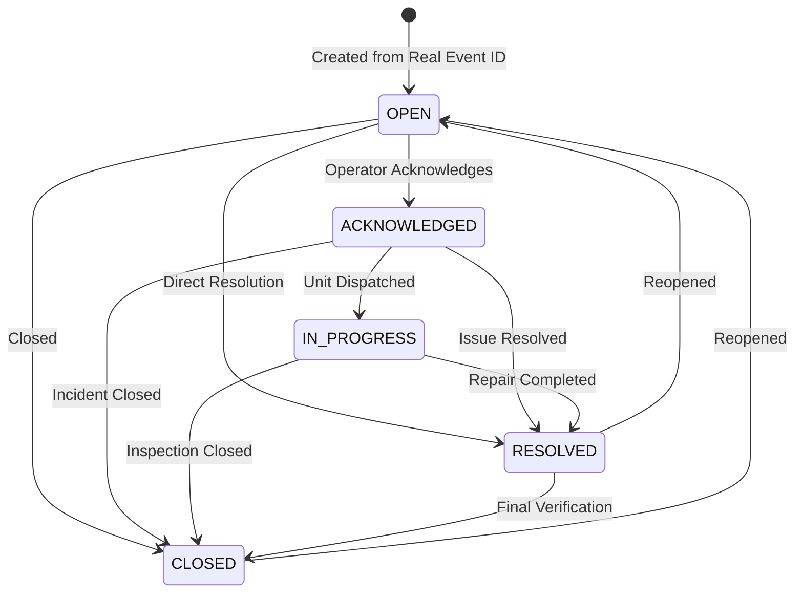
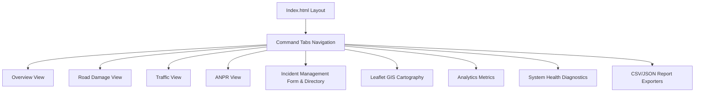
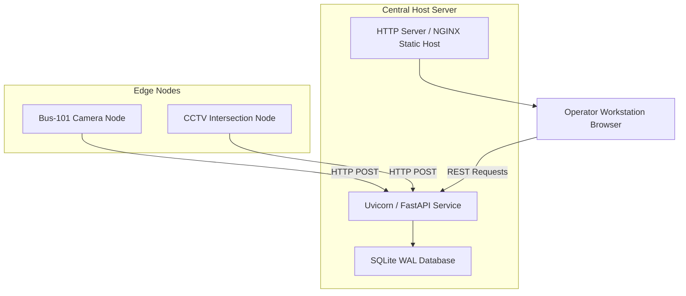
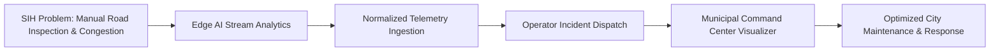

# SIH 2026 — System Architecture & Technical Flowcharts

This document defines the authoritative system architecture, technical flowcharts, database schemas, and data pipelines for the **SIH 2026 Smart Road Monitoring & Traffic Management Platform**.

---

## 1. Top-Level System Architecture Diagram

---

## 2. End-to-End Data Flow

---

## 3. AI Inference Pipeline

---

## 4. Backend Architecture

---

## 5. Database ER Diagram

---

## 6. Incident Lifecycle State Machine

---

## 7. Dashboard Component Architecture

---

## 8. Deployment Architecture

---

## 9. SIH Problem-to-Solution Workflow

