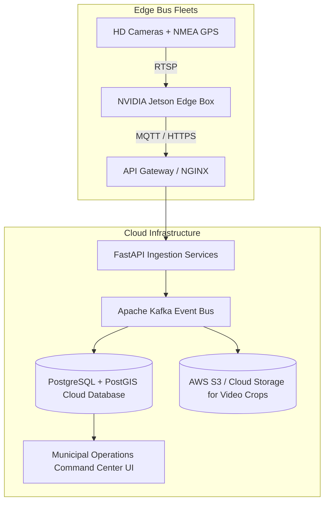

# SIH 2026 — Local & Cloud Deployment Guide

This document provides deployment instructions for local demonstration, edge deployment, and future production cloud scaling.

---

## 1. Quick Local Deployment (Prototype Demo)

### Step 1: Environment Setup
```bash
./scripts/setup.sh
```

### Step 2: Launch System Services
```bash
./scripts/run_demo.sh
```
This initializes the database, verifies model weights, and prints local service URLs:
- GIS Operations Dashboard UI: `http://127.0.0.1:3000`
- FastAPI REST Backend API: `http://127.0.0.1:8000`
- Interactive OpenAPI Swagger Docs: `http://127.0.0.1:8000/docs`

### Step 3: Run Automated Verification Suite
```bash
./scripts/verify_project.sh
```

---

## 2. Docker Container Deployment (Local / Staging)

### `Dockerfile` (Backend API Container)
```dockerfile
FROM python:3.10-slim

WORKDIR /app

RUN apt-get update && apt-get install -y --no-install-recommends \
    libgl1-mesa-glx \
    libglib2.0-0 \
    && rm -rf /var/lib/apt/lists/*

COPY requirements.txt .
RUN pip install --no-cache-dir -r requirements.txt

COPY src/ ./src/
COPY models/ ./models/
COPY data/ ./data/

EXPOSE 8000

CMD ["python", "-m", "uvicorn", "src.backend.app:app", "--host", "0.0.0.0", "--port", "8000"]
```

### `docker-compose.yml`
```yaml
version: '3.8'

services:
  backend:
    build: .
    ports:
      - "8000:8000"
    volumes:
      - ./data:/app/data

  dashboard:
    image: nginx:alpine
    ports:
      - "3000:80"
    volumes:
      - ./src/dashboard:/usr/share/nginx/html:ro
```

---

## 3. Future Production Cloud Architecture (Planned / Scope)


